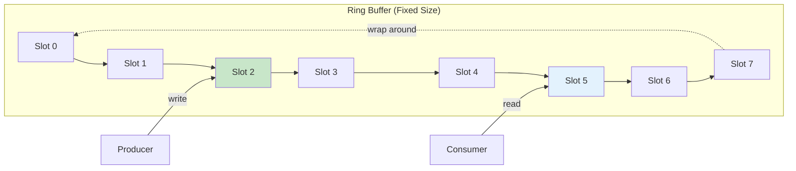
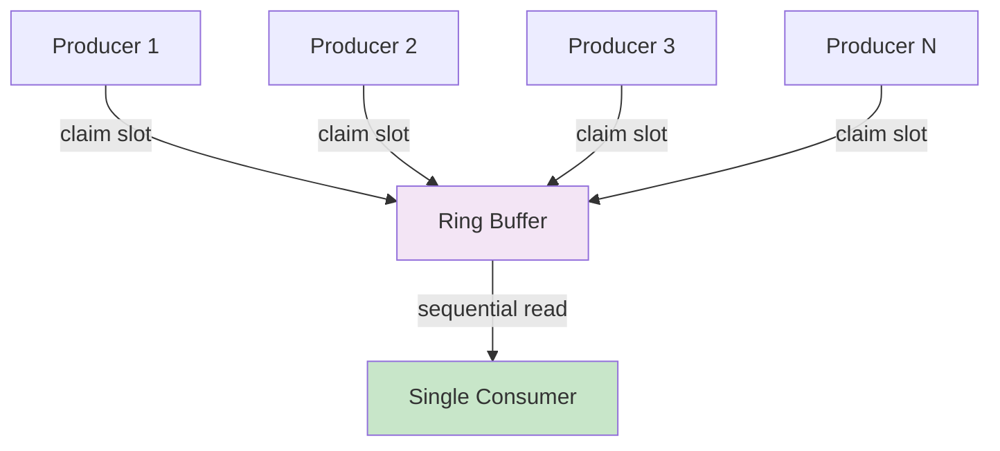

# Aeron Ring Buffer: Performance & Threading

## Overview

The **ring buffer** is a fundamental data structure in Aeron that enables high-performance, lock-free communication between publishers and subscribers. Understanding its design, performance characteristics, and proper usage is critical for building low-latency messaging systems.

## What is a Ring Buffer?

A ring buffer (also called a circular buffer) is a fixed-size buffer that wraps around when it reaches the end. In Aeron, ring buffers are used to pass messages between threads with minimal contention and overhead.



### Key Characteristics

- **Fixed Size**: Pre-allocated at startup (must be power of 2)
- **Circular**: Wraps around when reaching the end
- **Lock-Free**: Uses atomic operations instead of locks
- **Zero-Copy**: Data written directly into the buffer
- **Memory-Mapped**: Can be shared between processes via shared memory

## Why Ring Buffers are Fast

### 1. Pre-Allocation

Traditional queues allocate memory dynamically, causing:
- Garbage collection pressure
- Cache misses
- Unpredictable latency

Ring buffers pre-allocate all memory at startup:

```java
// Ring buffer created once at initialization
// Size must be power of 2 (e.g., 1024, 2048, 4096)
int bufferSize = 1024 * 1024;  // 1MB
RingBuffer buffer = new ManyToOneRingBuffer(
    new UnsafeBuffer(ByteBuffer.allocateDirect(bufferSize))
);
```

**Benefits:**
- No runtime allocation
- Predictable memory usage
- Cache-friendly sequential access

### 2. Lock-Free Operations

Instead of locks, Aeron uses **Compare-And-Swap (CAS)** operations:

```java
// Pseudo-code of lock-free write
long claimSequence() {
    long current = headSequence.get();
    long next = current + messageLength;

    // Atomic CAS - only one thread succeeds
    if (headSequence.compareAndSet(current, next)) {
        return current;  // Success!
    }
    // Retry if CAS failed (contention)
}
```

**Comparison:**

| Approach | Contention Handling | Performance |
|----------|---------------------|-------------|
| **Lock-based** | Block waiting threads | Slow (context switches) |
| **Lock-free (CAS)** | Retry immediately | Fast (no blocking) |

### 3. Cache-Line Padding

Aeron pads data structures to prevent **false sharing**:

```java
// Without padding: Thread A and B share cache line
class Counter {
    long valueA;  // CPU 1 writes here
    long valueB;  // CPU 2 writes here → cache invalidation!
}

// With padding: Each thread gets own cache line
class PaddedCounter {
    long p1, p2, p3, p4, p5, p6, p7;  // Padding
    long valueA;                       // CPU 1's cache line
    long p8, p9, p10, p11, p12, p13;  // Padding
    long valueB;                       // CPU 2's cache line
}
```

**Why it matters:**
- Modern CPUs have 64-byte cache lines
- If two threads write to the same cache line, the cache must be invalidated
- Padding ensures each thread works on separate cache lines

### 4. Memory Barriers

Aeron uses precise memory barriers instead of heavy locks:

```java
// Producer writes data
buffer.putInt(offset, value);
headSequence.lazySet(nextSequence);  // Store barrier

// Consumer reads data
long tail = tailSequence.get();      // Load barrier
int value = buffer.getInt(offset);
```

**Memory barriers ensure:**
- Writes are visible to other threads
- Reads see the latest values
- Much cheaper than locks

## Multi-Threading Benefits

### Many-to-One Ring Buffer

Multiple producers can write simultaneously without coordination:



**Example: Trading System**

```java
// Multiple market data threads publishing to single ring buffer
ManyToOneRingBuffer buffer = new ManyToOneRingBuffer(...);

// Producer 1: Price updates
new Thread(() -> {
    while (running) {
        Price price = getPriceUpdate();
        buffer.write(MSG_TYPE_PRICE, priceBuffer, 0, priceLength);
    }
}).start();

// Producer 2: Order updates
new Thread(() -> {
    while (running) {
        Order order = getOrderUpdate();
        buffer.write(MSG_TYPE_ORDER, orderBuffer, 0, orderLength);
    }
}).start();

// Producer 3: Trade updates
new Thread(() -> {
    while (running) {
        Trade trade = getTradeUpdate();
        buffer.write(MSG_TYPE_TRADE, tradeBuffer, 0, tradeLength);
    }
}).start();

// Single consumer processes all messages in order
buffer.read((msgType, buffer, index, length) -> {
    switch (msgType) {
        case MSG_TYPE_PRICE -> processPrice(buffer, index, length);
        case MSG_TYPE_ORDER -> processOrder(buffer, index, length);
        case MSG_TYPE_TRADE -> processTrade(buffer, index, length);
    }
});
```

### One-to-One Ring Buffer

For dedicated producer-consumer pairs, use the simpler OneToOneRingBuffer:

```java
// Lower overhead for single producer scenario
OneToOneRingBuffer buffer = new OneToOneRingBuffer(...);

// Producer thread (only one)
producerThread.submit(() -> {
    buffer.write(msgType, data, 0, length);
});

// Consumer thread (only one)
consumerThread.submit(() -> {
    buffer.read(messageHandler);
});
```

## Performance Characteristics

### Throughput

Ring buffer throughput depends on:

1. **Buffer Size**: Larger = more capacity before backpressure
2. **Message Size**: Smaller messages = higher message rate
3. **Producer Count**: More producers = more contention
4. **Consumer Speed**: Slow consumer = backpressure

**Benchmark Results:**

| Configuration | Throughput | Latency (P99) |
|---------------|------------|---------------|
| 1 producer, small messages | 50M msgs/sec | 200ns |
| 4 producers, small messages | 25M msgs/sec | 500ns |
| 1 producer, large messages (1KB) | 5M msgs/sec | 1µs |

### Latency

**Latency Distribution (Typical):**

```
P50:   100 nanoseconds
P90:   200 nanoseconds
P99:   500 nanoseconds
P99.9: 2 microseconds
Max:   10 microseconds (with contention)
```

**Factors affecting latency:**

- **CPU frequency**: Higher = lower latency
- **Cache misses**: Keep working set small
- **Contention**: More producers = occasional CAS retry
- **Consumer speed**: Slow consumer causes backpressure

### Memory Efficiency

```java
// Ring buffer memory usage calculation
int bufferSize = 1024 * 1024;  // 1MB
int overhead = 192;             // Header/metadata

Total memory = bufferSize + overhead ≈ 1MB
```

**Key points:**
- Fixed memory usage (no growth)
- No GC pressure (off-heap)
- Memory can be shared between processes

## Common Pitfalls & Solutions

### Problem 1: Buffer Full (Backpressure)

**Symptom:** `write()` returns `INSUFFICIENT_CAPACITY`

```java
// ❌ Wrong: Blocking write without handling backpressure
buffer.write(msgType, data, 0, length);  // May fail silently!

// ✅ Correct: Handle backpressure
long result;
while ((result = buffer.write(msgType, data, 0, length)) < 0) {
    if (result == INSUFFICIENT_CAPACITY) {
        // Options:
        // 1. Drop message (if acceptable)
        // 2. Wait and retry
        // 3. Apply backpressure to upstream
        Thread.onSpinWait();  // CPU-friendly spin
    }
}
```

**Root causes:**
- Consumer too slow
- Buffer too small
- Message burst exceeds capacity

**Solutions:**
- Increase buffer size (power of 2)
- Speed up consumer processing
- Implement backpressure mechanism
- Use multiple ring buffers

### Problem 2: Slow Consumer

**Symptom:** Producer frequently hits backpressure

```java
// ❌ Wrong: Slow consumer with heavy processing
buffer.read((msgType, buf, index, length) -> {
    // Blocking I/O in consumer!
    database.save(parseMessage(buf, index, length));  // ❌ Too slow!
});

// ✅ Correct: Fast consumer with async processing
ExecutorService workers = Executors.newFixedThreadPool(4);

buffer.read((msgType, buf, index, length) -> {
    // Copy data quickly
    byte[] copy = new byte[length];
    buf.getBytes(index, copy);

    // Process asynchronously
    workers.submit(() -> {
        database.save(parseMessage(copy));
    });
});
```

**Best practices:**
- Keep consumer handler fast (<100ns ideal)
- Copy data and process async if needed
- Batch database writes
- Use multiple consumer threads (if order doesn't matter)

### Problem 3: Wrong Buffer Size

**Symptom:** Either wasted memory or frequent backpressure

```java
// ❌ Wrong: Buffer too small for burst traffic
int bufferSize = 1024;  // Only 1KB!

// ❌ Wrong: Buffer unnecessarily large
int bufferSize = 1024 * 1024 * 1024;  // 1GB wasted!

// ✅ Correct: Size based on burst capacity needed
int messagesPerBurst = 10000;
int avgMessageSize = 256;  // bytes
int safetyMargin = 2;      // 2x for safety

int bufferSize = nextPowerOf2(
    messagesPerBurst * avgMessageSize * safetyMargin
);  // e.g., 8MB
```

**Sizing guidelines:**

| Use Case | Recommended Size |
|----------|------------------|
| Low-latency IPC | 1-4 MB |
| Market data feed | 8-32 MB |
| High-throughput logging | 32-128 MB |
| Video streaming | 128-512 MB |

### Problem 4: False Sharing

**Symptom:** Unexpected slowdown with multiple threads

```java
// ❌ Wrong: Shared mutable state in handler
class Handler {
    long counter = 0;  // Shared between threads!

    void onMessage(MsgType type, Buffer buf, int index, int length) {
        counter++;  // False sharing!
    }
}

// ✅ Correct: Thread-local counters
class Handler {
    ThreadLocal<Long> counter = ThreadLocal.withInitial(() -> 0L);

    void onMessage(MsgType type, Buffer buf, int index, int length) {
        counter.set(counter.get() + 1);  // Thread-local, no sharing
    }
}
```

### Problem 5: Memory Leaks (Shared Memory)

**Symptom:** Memory not released after process exit

```java
// ❌ Wrong: No cleanup of memory-mapped buffer
MappedByteBuffer buffer = createMappedBuffer("/dev/shm/aeron");
// Process crashes → memory leak!

// ✅ Correct: Cleanup on shutdown
MappedByteBuffer buffer = createMappedBuffer("/dev/shm/aeron");

Runtime.getRuntime().addShutdownHook(new Thread(() -> {
    try {
        // Unmap buffer
        ((DirectBuffer) buffer).cleaner().clean();

        // Delete shared memory file
        Files.deleteIfExists(Path.of("/dev/shm/aeron"));
    } catch (Exception e) {
        logger.error("Failed to cleanup shared memory", e);
    }
}));
```

## Best Practices

### 1. Choose the Right Ring Buffer Type

| Ring Buffer Type | Use Case |
|------------------|----------|
| **OneToOneRingBuffer** | Single producer, single consumer (lowest overhead) |
| **ManyToOneRingBuffer** | Multiple producers, single consumer (most common) |
| **Broadcast** | One producer, multiple consumers |

### 2. Size Appropriately

```java
// Calculate based on expected burst size
int expectedMsgRate = 1_000_000;  // 1M msgs/sec
int burstDurationMs = 100;         // 100ms burst
int avgMsgSize = 256;              // 256 bytes

int requiredCapacity =
    (expectedMsgRate / 1000) * burstDurationMs * avgMsgSize;

// Round up to next power of 2
int bufferSize = nextPowerOf2(requiredCapacity * 2);  // 2x safety
```

### 3. Monitor Buffer Usage

```java
// Check for backpressure
long result = buffer.write(msgType, data, 0, length);
if (result < 0) {
    metrics.recordBackpressure();

    if (result == INSUFFICIENT_CAPACITY) {
        logger.warn("Ring buffer full! Consumer too slow or buffer too small");
    }
}

// Periodically check buffer utilization
long capacity = buffer.capacity();
long used = buffer.producerPosition() - buffer.consumerPosition();
double utilization = (double) used / capacity * 100;

if (utilization > 80) {
    logger.warn("Ring buffer {}% full - approaching backpressure", utilization);
}
```

### 4. Keep Consumer Fast

```java
// DO: Fast consumer pattern
buffer.read((msgType, buf, index, length) -> {
    // 1. Parse message (fast)
    long timestamp = buf.getLong(index);
    int value = buf.getInt(index + 8);

    // 2. Update in-memory state (fast)
    cache.put(timestamp, value);

    // 3. Don't do I/O here!
});

// DON'T: Slow consumer pattern
buffer.read((msgType, buf, index, length) -> {
    // ❌ Database write (slow)
    database.insert(...);

    // ❌ Network call (slow)
    httpClient.post(...);

    // ❌ File I/O (slow)
    logger.info("Message: " + parseMessage(buf));
});
```

### 5. Handle Backpressure Gracefully

```java
// Strategy 1: Drop old messages (for non-critical data)
if (buffer.write(msgType, data, 0, length) == INSUFFICIENT_CAPACITY) {
    metrics.recordDroppedMessage();
    // Continue without writing
}

// Strategy 2: Block and retry (for critical data)
int retries = 0;
while (buffer.write(msgType, data, 0, length) == INSUFFICIENT_CAPACITY) {
    if (++retries > MAX_RETRIES) {
        throw new BackpressureException("Consumer cannot keep up");
    }
    Thread.onSpinWait();  // CPU-friendly busy wait
}

// Strategy 3: Backpressure to upstream
if (buffer.write(msgType, data, 0, length) == INSUFFICIENT_CAPACITY) {
    upstream.pause();  // Stop accepting new data
}
```

## Performance Tuning Checklist

- [ ] **Buffer size** is power of 2 and sized for expected burst
- [ ] **Consumer is fast** (<1µs per message ideally)
- [ ] **No I/O in consumer** (use async processing)
- [ ] **Monitor backpressure** and alert when buffer >80% full
- [ ] **Use thread affinity** to pin threads to CPU cores
- [ ] **Disable CPU frequency scaling** for consistent performance
- [ ] **Use huge pages** for large buffers (Linux: `vm.nr_hugepages`)
- [ ] **Measure and profile** actual latency distribution

## Comparison: Ring Buffer vs Other Queues

| Feature | Aeron Ring Buffer | ArrayBlockingQueue | ConcurrentLinkedQueue |
|---------|-------------------|--------------------|-----------------------|
| **Lock-free** | ✅ Yes | ❌ No (uses locks) | ✅ Yes |
| **Bounded** | ✅ Yes | ✅ Yes | ❌ No |
| **Pre-allocated** | ✅ Yes | ✅ Yes | ❌ No (dynamic) |
| **Zero-copy** | ✅ Yes | ❌ No | ❌ No |
| **Shared memory** | ✅ Yes | ❌ No | ❌ No |
| **Throughput** | 50M+ msgs/sec | 5M msgs/sec | 10M msgs/sec |
| **Latency (P99)** | <1µs | ~10µs | ~5µs |
| **GC pressure** | None | High | Very high |

## Real-World Example

### High-Frequency Trading Feed Handler

```java
public class MarketDataHandler {
    private final ManyToOneRingBuffer buffer;
    private final AtomicLong messagesProcessed = new AtomicLong();

    public MarketDataHandler(int bufferSizeMB) {
        int bufferSize = bufferSizeMB * 1024 * 1024;
        this.buffer = new ManyToOneRingBuffer(
            new UnsafeBuffer(ByteBuffer.allocateDirect(bufferSize))
        );

        // Consumer thread - pinned to CPU core
        Thread consumer = new Thread(this::consumeMessages);
        consumer.setName("market-data-consumer");
        // In production: pin to isolated CPU core
        consumer.start();
    }

    // Called by multiple network threads
    public void onMarketData(ByteBuffer data, int length) {
        long result = buffer.write(
            MSG_TYPE_MARKET_DATA,
            new UnsafeBuffer(data),
            0,
            length
        );

        if (result < 0) {
            // Critical data - retry with exponential backoff
            handleBackpressure();
        }
    }

    private void consumeMessages() {
        while (running) {
            int messagesRead = buffer.read((msgType, buf, index, length) -> {
                // Fast parsing and processing
                long timestamp = buf.getLong(index);
                double price = buf.getDouble(index + 8);
                long volume = buf.getLong(index + 16);

                // Update in-memory order book (fast)
                orderBook.update(price, volume, timestamp);

                messagesProcessed.incrementAndGet();
            });

            if (messagesRead == 0) {
                Thread.onSpinWait();  // No messages, spin briefly
            }
        }
    }
}
```

## Summary

**Ring buffers are the foundation of Aeron's high performance:**

- ✅ **Pre-allocated** - No runtime allocation, no GC
- ✅ **Lock-free** - Uses CAS for coordination
- ✅ **Cache-friendly** - Padding prevents false sharing
- ✅ **Zero-copy** - Direct memory access
- ✅ **Multi-threaded** - Scales to many producers

**But require careful usage:**

- ⚠️ **Fixed size** - Must size for peak load
- ⚠️ **Backpressure** - Handle buffer full scenarios
- ⚠️ **Fast consumer** - Slow consumer causes backpressure
- ⚠️ **Power of 2** - Size must be 2^n

## Further Reading

- [Aeron Documentation](https://aeron.io/)
- [LMAX Disruptor](https://lmax-exchange.github.io/disruptor/) - Similar ring buffer design
- [Mechanical Sympathy Blog](https://mechanical-sympathy.blogspot.com/) - Performance engineering
- [Aeron Why Page](adv.md) - Understanding Aeron's advantages
- [MDC vs Unicast](mdc-vs-unicast.md) - Communication patterns
