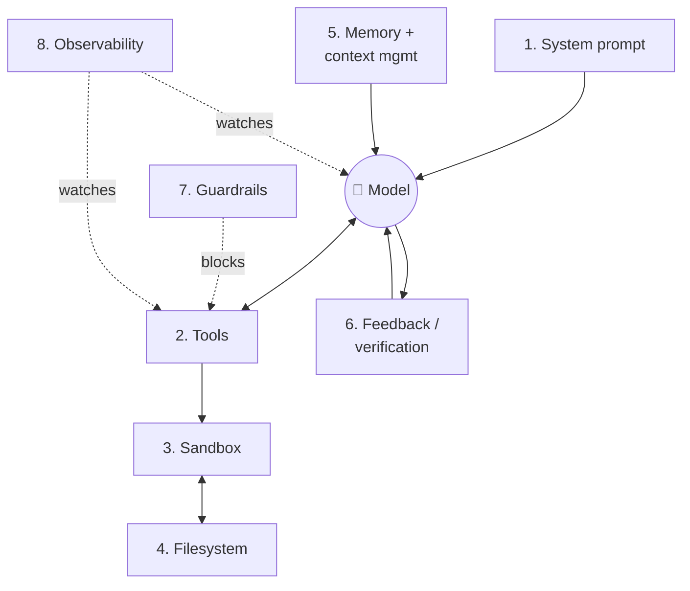
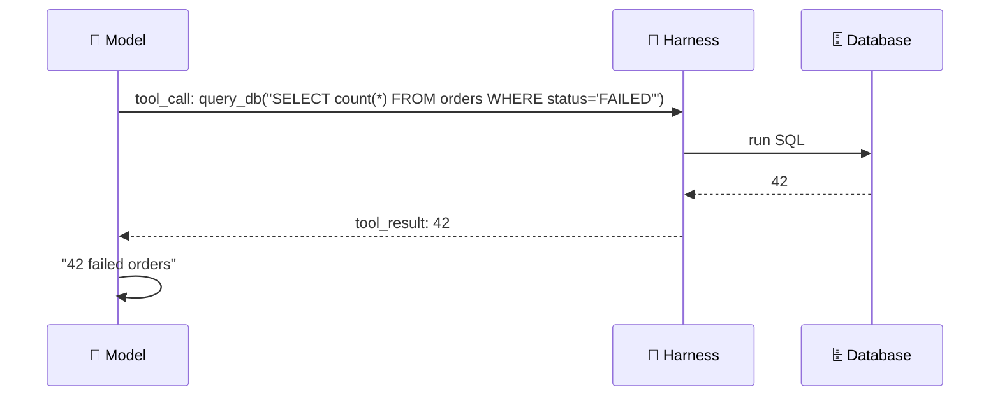
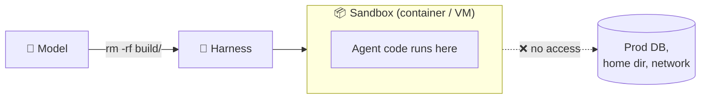
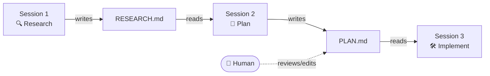
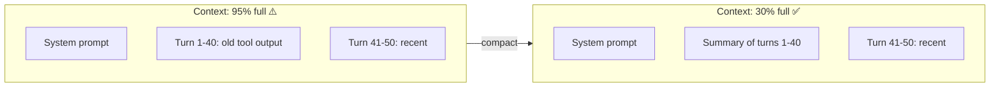
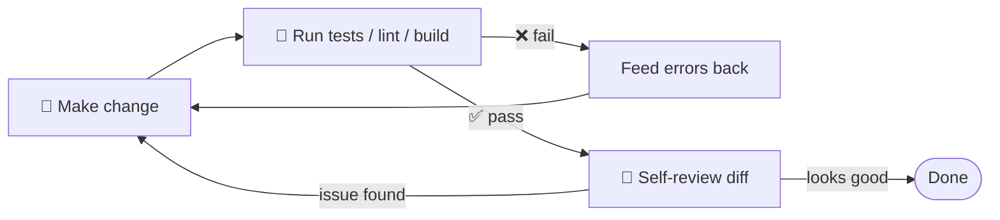
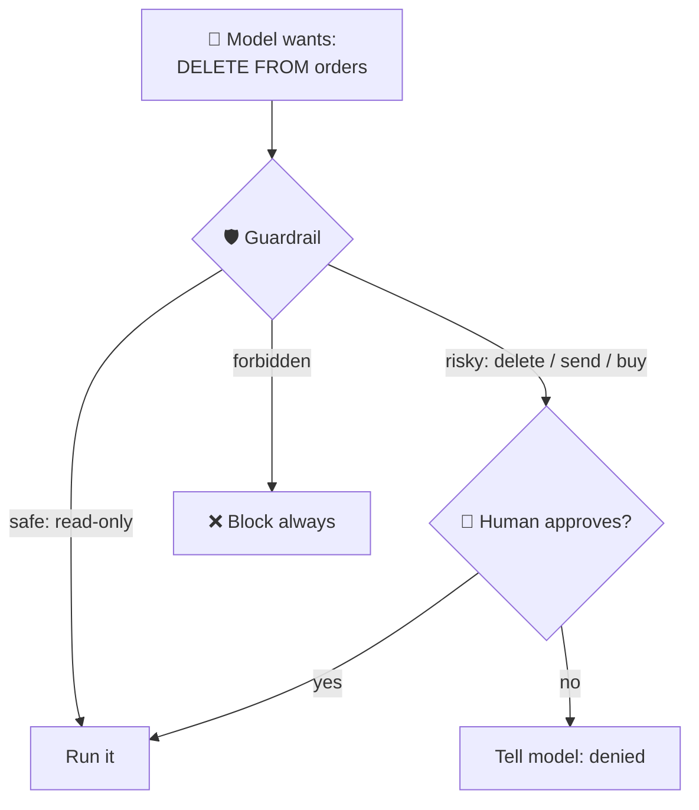
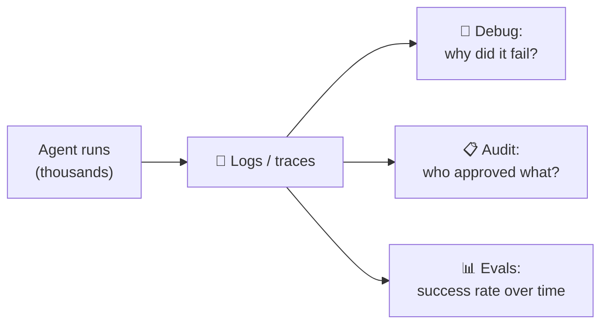

# Harness Building Blocks

The 8 parts most production harnesses are built from. Each one fixes a limit of the raw model.



| # | Block | Fixes this model limit | Claude Code example |
|---|---|---|---|
| 1 | [System prompt](#1-system-prompt) | No standing role or rules | system prompt + `CLAUDE.md` |
| 2 | [Tools](#2-tools-and-tool-execution) | Can't touch the outside world | Read, Edit, Bash, MCP servers |
| 3 | [Sandbox](#3-sandbox) | Running agent code is risky | sandbox mode, worktrees |
| 4 | [Filesystem](#4-filesystem-and-durable-storage) | Chat disappears | repo files, `PLAN.md` hand-offs |
| 5 | [Memory + context](#5-memory-and-context-management) | Forgets anything outside the window | auto-compact, memory files |
| 6 | [Feedback loops](#6-feedback-loops-and-self-verification) | Declares success too early | hooks, test runs |
| 7 | [Guardrails](#7-guardrails-and-human-in-the-loop) | Takes irreversible actions | permission prompts, allow/deny rules |
| 8 | [Observability](#8-observability-and-logging) | Can't debug or audit | transcripts, OpenTelemetry |

---

## 1. System prompt

Standing instructions sent on **every** run: who the agent is, its goal, and its rules. They shape behavior before any user input arrives.

!!! example
    ```text
    You are a Java code reviewer for a low-latency trading system.
    - Never suggest allocations on the hot path.
    - Flag any use of synchronized in Agrona agents.
    - Answer with file:line references.
    ```

!!! warning "Common problem"
    A vague or conflicting system prompt is one of the top causes of **inconsistent** agent behavior.

---

## 2. Tools and tool execution

Functions the model can call. The **model picks** the tool; the **harness runs** it.



!!! example "Tool definition the model sees"
    ```json
    {
      "name": "query_db",
      "description": "Run a read-only SQL query on the orders DB",
      "input_schema": {
        "type": "object",
        "properties": { "sql": { "type": "string" } },
        "required": ["sql"]
      }
    }
    ```

!!! tip "Trend: fewer narrow tools, more code execution"
    Instead of 50 tools (`get_order`, `get_trade`, `get_client`, …), give the agent **one** general tool: *write and run code*. The model builds the workflow on the fly.

    | Narrow tools | General tool |
    |---|---|
    | `get_order(id)`, `cancel_order(id)`, `list_orders(date)` … | `run_python(code)` |
    | Fixed set of actions | Model writes whatever it needs |
    | Many tool descriptions eat context | One description |

---

## 3. Sandbox

An isolated workspace where agent code runs **without affecting the real system**.



Why it matters:

- **Safe to experiment**: a bad command only breaks the sandbox.
- **Resettable**: throw it away and start clean.
- **Parallel**: run 10 agents in 10 sandboxes at once.

!!! example
    Claude Code sandbox mode limits Bash to the project dir and blocks network access. A git **worktree** gives each agent its own copy of the repo.

---

## 4. Filesystem and durable storage

A place to read and write files that **outlive the chat**: code, notes, plans, and intermediate results.



!!! example
    Long task over 3 days: the agent keeps `PLAN.md` with checkboxes. Each new session reads it and continues from the first unticked item. A human or another agent can also edit the same file.

---

## 5. Memory and context management

The model only knows what's in its **context window**. The harness decides what goes in and what gets dropped.

**Within a task: context compaction**



**Across sessions: stored memory**

| Kind | Example |
|---|---|
| User preference | "User prefers concise answers" |
| Project fact | "Deploy with `mkdocs gh-deploy --force`" |
| Work history | "Ticket ABC-123: done steps 1-3, blocked on step 4" |

!!! example
    Claude Code auto-compacts when the window fills up. `CLAUDE.md` and memory files are loaded at session start, so the agent knows the project without being told again.

---

## 6. Feedback loops and self-verification

A good harness doesn't just let the model act. It **checks the work**.



!!! example "Claude Code hook: always run tests after an edit"
    ```json
    {
      "hooks": {
        "PostToolUse": [{
          "matcher": "Edit|Write",
          "hooks": [{ "type": "command", "command": "mvn -q test" }]
        }]
      }
    }
    ```
    If tests fail, the output goes back to the model, which has to fix it before claiming it's done.

---

## 7. Guardrails and human-in-the-loop

Rules that **block** unsafe or unapproved actions. A human-in-the-loop guardrail pauses until a person approves.



| Action | Rule |
|---|---|
| `git status`, read file | allow |
| `git push`, send email, delete file | ask human |
| `rm -rf /`, drop prod table | deny |

!!! example "Claude Code permissions"
    ```json
    {
      "permissions": {
        "allow": ["Bash(git status)", "Bash(mvn test:*)"],
        "ask":   ["Bash(git push:*)"],
        "deny":  ["Bash(rm -rf:*)"]
      }
    }
    ```

---

## 8. Observability and logging

See **what** the agent did, **why**, and **where** it went wrong.



!!! example "One trace"
    ```text
    [10:01:02] model  → tool_call Read(OrderService.java)
    [10:01:03] tool   ← 240 lines
    [10:01:07] model  → tool_call Edit(line 42)
    [10:01:07] guard  ✓ allowed (Edit in project dir)
    [10:01:09] hook   mvn test → FAILED (NullPointerException)
    [10:01:15] model  → tool_call Edit(line 40)
    [10:01:18] hook   mvn test → PASSED
    [10:01:19] model  → final answer
    ```

- **Developers:** debug bad decisions.
- **Enterprises:** audit trail (required in regulated industries).
- **At scale:** feeds evals that measure success over thousands of runs, not one demo.

---

Next: [Failure Modes & Future](failure-modes.md)
