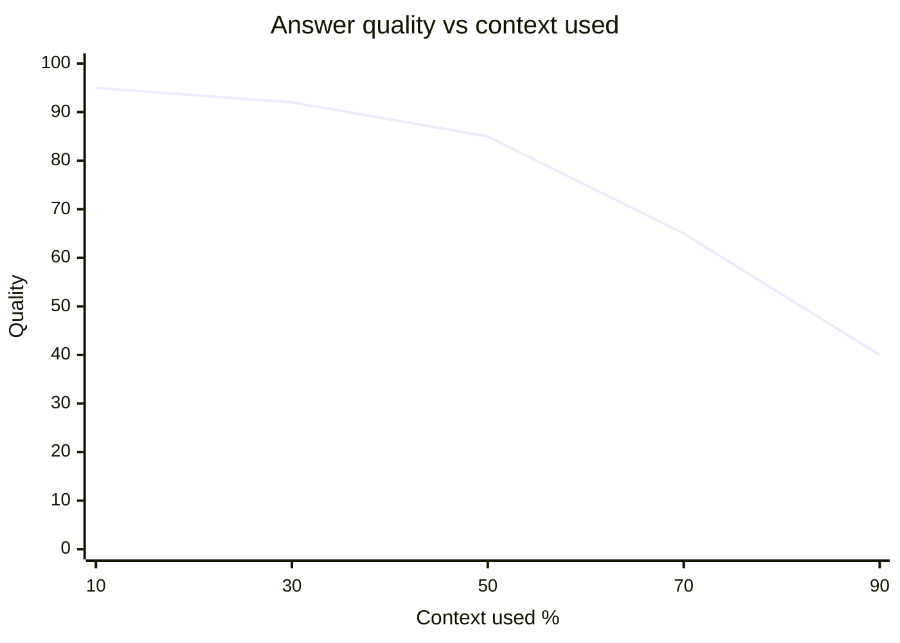
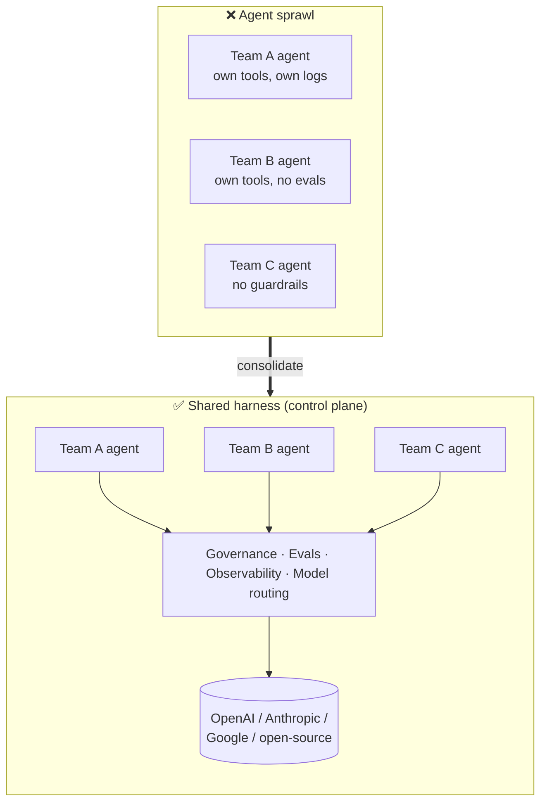
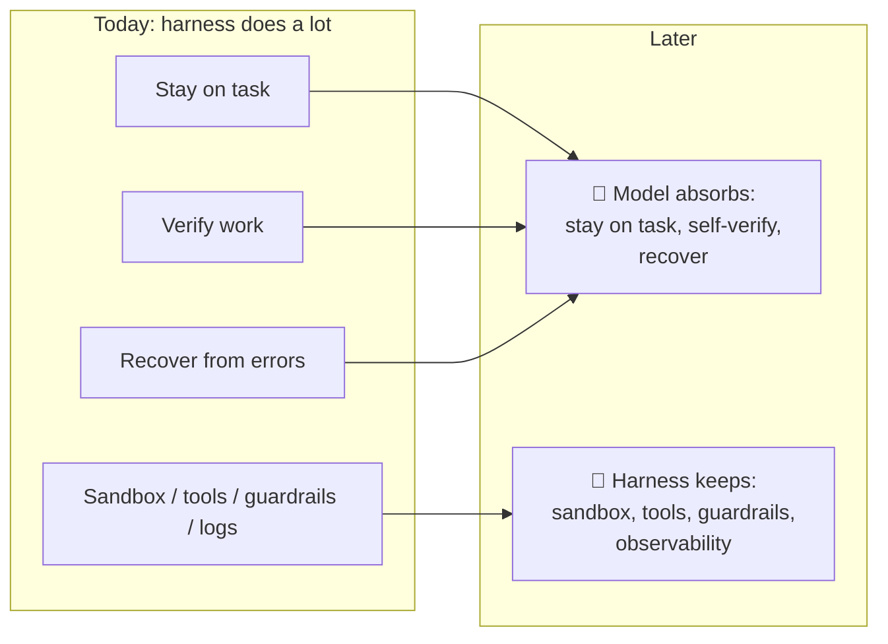

# Harness Failure Modes & Future

!!! info "Key idea"
    Most production agent failures come from the **harness**, not the model.

---

## Common failure modes

| Failure | Symptom | Fix |
|---|---|---|
| [Context rot](#context-rot) | Gets worse the longer it runs | Compact, split into phases |
| [Tool overload](#tool-overload) | Picks the wrong tool, slow to start | Fewer, general tools; load on demand |
| [Brittle tool wiring](#brittle-tool-wiring) | Silent wrong calls after a small change | Clear descriptions, eval tool changes |
| [Latency](#latency) | 10s+ per response | Parallel calls, smaller model for sub-steps |
| [Irrelevant retrieval](#irrelevant-retrieval) | Confident but wrong answer | Better retrieval, cite sources |
| [Weak verification](#weak-verification) | "Done!" but it's not | Tests/checks in the loop |
| [Missing guardrails](#missing-guardrails) | Irreversible action without approval | Permission gates, human-in-the-loop |

(The Fix column is my own notes, not from the article.)

### Context rot

Reasoning quality drops as history grows.

!!! example
    After 80 turns of debugging, the agent forgets the constraint "no allocations on the hot path" from turn 3 and adds `new ArrayList<>()` inside `onFragment()`.

    **Fix:** compact, or write findings to `NOTES.md` and start a fresh session.

### Tool overload

Too many tools → confusion and slow decisions.

!!! example
    60 MCP tools loaded: `search_jira`, `search_confluence`, `search_slack`, `search_docs`… For "find the design doc", the model tries 4 search tools in a row.

    **Fix:** load only the tools the current task needs (skills / on-demand MCP).

### Brittle tool wiring

A small change in a tool description or schema → wrong usage, silent failures.

!!! example
    You rename the param `date` → `trade_date`. The description still says "date". The model keeps sending `date`, the tool ignores it and returns **today's** trades. No error is raised.

### Latency

Many sequential tool calls → slow.

```mermaid
gantt
    title Sequential vs parallel tool calls
    dateFormat s
    axisFormat %Ss
    section Sequential
    read A :0, 2
    read B :2, 2
    read C :4, 2
    section Parallel
    read A :0, 2
    read B :0, 2
    read C :0, 2
```

### Irrelevant retrieval

The harness fetches the wrong docs → the model answers confidently from them.

!!! example
    "What's our FIX session timeout?" → retrieval returns the **UAT** config instead of **prod** → the agent answers "30s", but prod is 60s.

### Weak verification

No tests or checks in the loop → the agent stops early or claims success.

!!! example
    "Refactor done ✅", but it never compiled. A `PostToolUse` hook running `mvn compile` would have caught it.

### Missing guardrails

Irreversible actions without oversight: sending messages, deleting data, buying things.

!!! example
    The agent "cleans up test data" with `DELETE FROM trades WHERE ...` on the wrong DB connection. An **ask** rule on `DELETE` would have paused it for approval.

---

## Enterprise: agent sprawl

Companies build **dozens** of agents across teams. Without shared infrastructure, nobody can govern, evaluate, or improve them all.

A shared layer provides:

- **Access control**: which data and actions each agent can use
- **Evaluation**: measure every agent the same way
- **Audit + observability**: one place to look
- **Model swapping**: change the provider without rebuilding the agent

!!! example "Databricks Agent Bricks"
    Governance through **Unity Catalog**, observability/evals through **MLflow**, and it works with models from many providers.

---

## Where it's heading

The harness won't disappear. Execution, tools, guardrails, and observability still decide how reliable an agent is.

### Two emerging ideas

| Idea | What | Example |
|---|---|---|
| **Disposable harness** | Lightweight, task-specific, thrown away after one workflow | Spin up a container with 2 tools to migrate one repo, then delete it |
| **Natural-language agent harness (NLAH)** | Describe agent behavior in plain language; a shared runtime runs it | A `SKILL.md` saying "when asked to release: bump version, run tests, tag, ask before push" |

!!! quote
    The model contains the intelligence. The harness turns that intelligence into reliable work.

---

Back: [Overview](index.md) · [Building Blocks](building-blocks.md)
