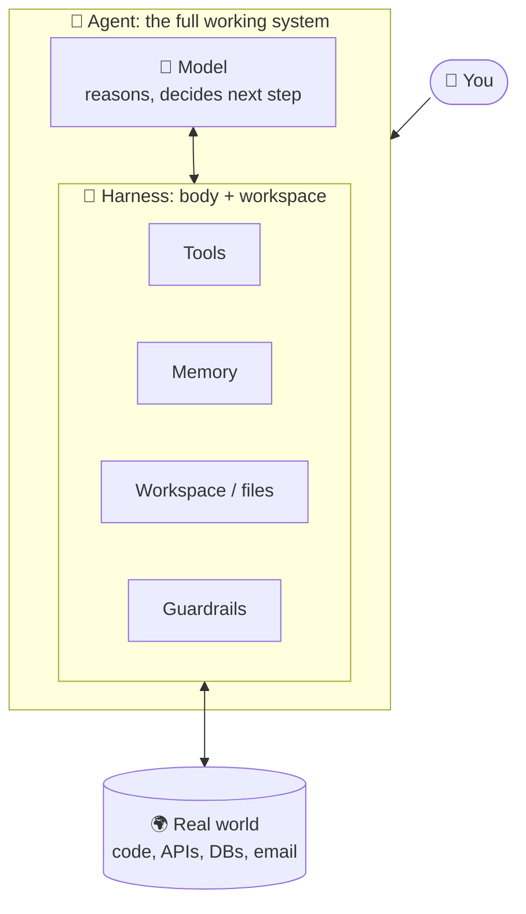
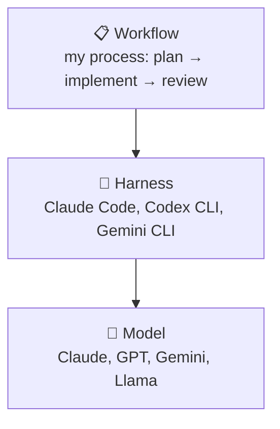
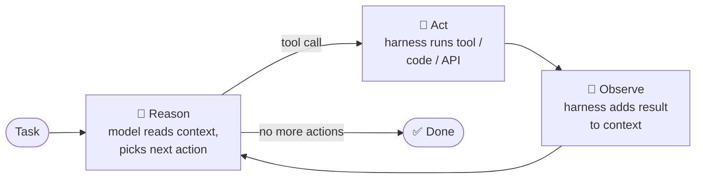
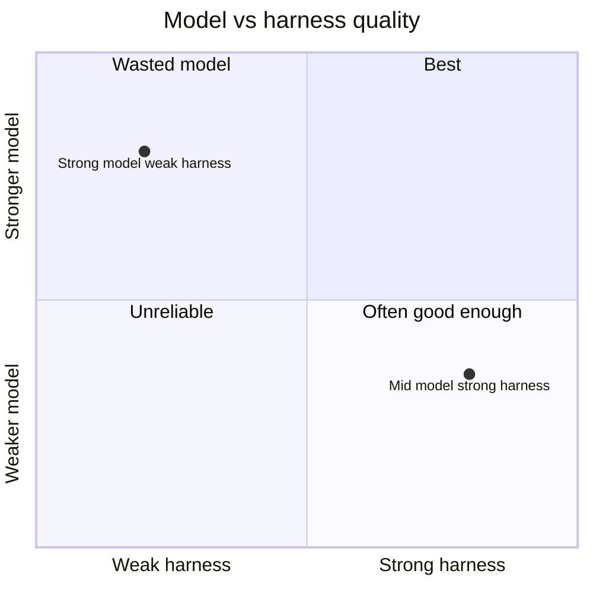
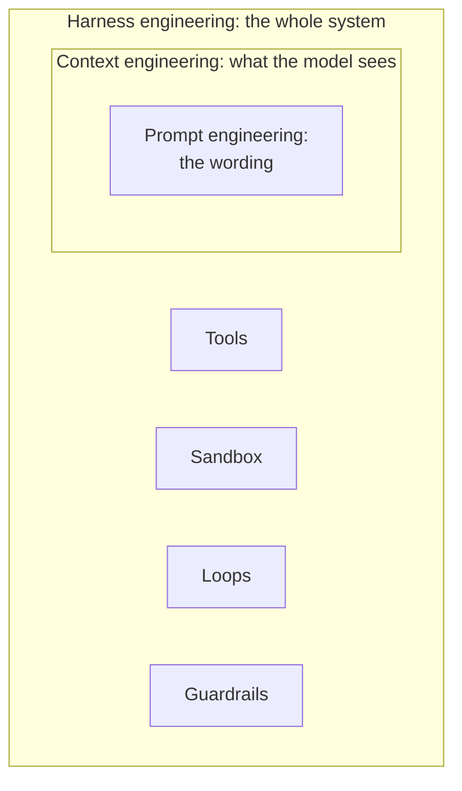
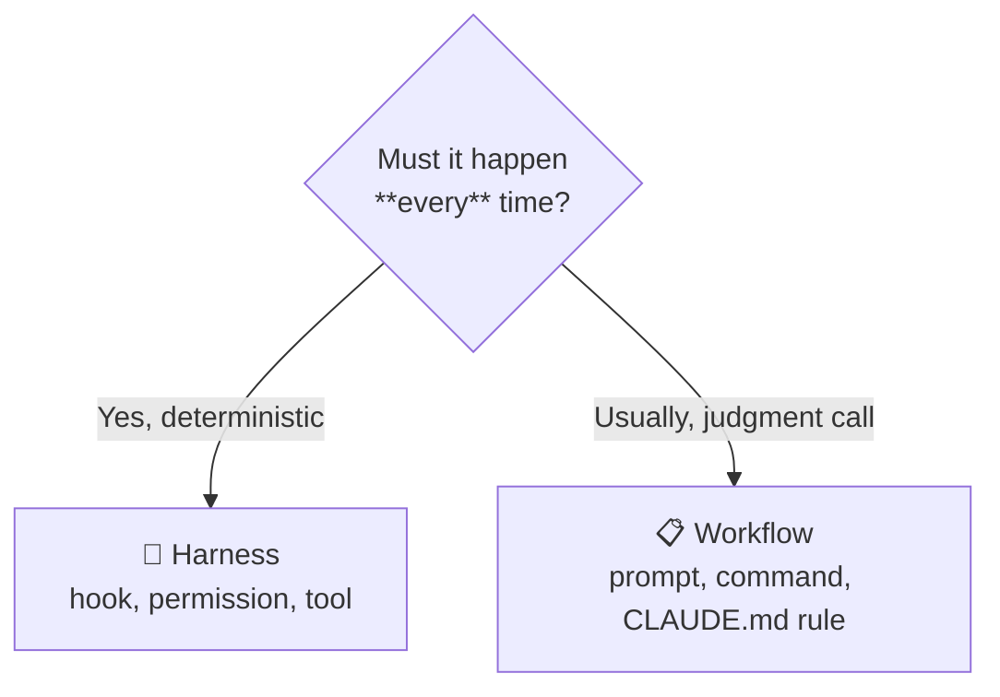

# AI Harness

Notes while exploring the **harness**: everything around the model that turns it into a working agent.

!!! abstract "One-line summary"
    **Agent = Model + Harness.** The model *thinks*. The harness lets it *act* safely and reliably.

**Pages in this section:**

1. **Overview** (this page): what a harness is and how the loop works
2. [Building Blocks](building-blocks.md): the 8 parts of a harness, each with an example
3. [Failure Modes & Future](failure-modes.md): what goes wrong, enterprise use, where it's heading

Related: [Agentic Workflows Catalog](../agentic-workflows-catalog.md) covers the **workflow** layer on top of the harness.

---

## Model vs. harness vs. agent



| Part | What it does | Analogy |
|---|---|---|
| **Model** | Reads context, reasons, picks next action. Has no memory and can't act on its own | Brain |
| **Harness** | Runs tools, manages memory, enforces rules | Body + desk + rulebook |
| **Agent** | Model + harness together | A worker who can think *and* act |

!!! example "Same question, with and without a harness"
    **Task:** "How many failed orders were there yesterday?"

    - **Model only:** "I don't have access to your database, but you could run `SELECT COUNT(*) ...`"
    - **Model + harness:** the model writes the SQL → the harness runs it on the DB → the result `42` comes back → the model answers "42 failed orders, mostly timeouts from venue X."

---

## Where the harness sits



- **Model**: bought or picked, not built.
- **Harness**: the runtime. You configure it (tools, permissions, hooks) or build your own.
- **Workflow**: your process on top. See the [catalog](../agentic-workflows-catalog.md).

---

## The core loop: Reason → Act → Observe

This loop is at the center of every agent. It's called **ReAct**, from [Yao et al., 2022](https://arxiv.org/abs/2210.03629).



| Step | Who | What |
|---|---|---|
| Reason | Model | Read task + memory + previous results → decide the next action |
| Act | Harness | Run the tool, sandboxed code, or API call |
| Observe | Harness | Capture the result and feed it back as new context |
| Repeat | Both | Until the model says it's done |

!!! example "Coding agent fixing a bug"
    ```mermaid
    sequenceDiagram
        participant U as 👤 User
        participant M as 🧠 Model
        participant H as 🦾 Harness
        participant S as 📦 Sandbox
        U->>M: "Fix failing test in OrderService"
        M->>H: read OrderService.java
        H->>S: cat file
        S-->>H: file content
        H-->>M: file content
        M->>H: edit line 42, run tests
        H->>S: apply edit, mvn test
        S-->>H: ❌ 1 test failed (NPE)
        H-->>M: test output
        Note over M: Reason: null check missing
        M->>H: edit line 40, run tests
        H->>S: apply edit, mvn test
        S-->>H: ✅ all tests pass
        H-->>M: test output
        M->>U: "Fixed: added null check for venue"
    ```

    The model never touches the file system. It only **asks**, and the harness **does**.

---

## Why the harness matters

!!! tip "Key idea"
    Models are getting similar in ability, so **the harness now decides performance**. The same model can rank very differently on a benchmark depending on its harness.



- A strong harness + mid-tier model can **beat** a weak harness + strong model on workflow-heavy tasks.
- **Data point:** Databricks OfficeQA Pro Agent Harness scored 36.10% with GPT-5.4 and 52.63% with GPT-5.5, almost halving errors. The harness is what turns a model upgrade into reliable results.

---

## Prompt → context → harness engineering

The focus has moved outward from the model. Each stage sits inside the next.



| Discipline | Focus | Example |
|---|---|---|
| Prompt engineering | Wording of the input | "You are a senior Java dev. Answer in bullet points." |
| Context engineering | What info goes in the window, and when | RAG: fetch the 3 most relevant docs before answering |
| Harness engineering | Tools, sandbox, loops, guardrails | Run `mvn test` after every edit; block `git push` without approval |

---

## Harness vs. workflow: where does a change go?



| I want to… | Layer | How (Claude Code) |
|---|---|---|
| Block `rm -rf` every time | Harness | permission deny rule |
| Always run tests after an edit | Harness | `PostToolUse` hook |
| Plan before coding | Workflow | `/plan` command or prompt |
| Keep project rules | Both | `CLAUDE.md` (the harness loads it, you write the content) |
| Let the agent query KDB | Harness | MCP server / tool |

---

## Exploration checklist

- [x] Read the Databricks article and add its key points
- [ ] Map each building block to Claude Code features in detail
- [ ] Compare harnesses: Claude Code vs. Codex CLI vs. Gemini CLI
- [ ] Build a minimal harness (ReAct loop + 2 tools) to see the moving parts
- [ ] Context management deep dive: compaction, sub-agents, file hand-offs
- [ ] Sandboxing and permissions deep dive
- [ ] How to evaluate a harness change (same model, different harness)
- [ ] Read the ReAct paper

---

## Sources

- [Databricks: What is an AI Agent Harness?](https://www.databricks.com/blog/ai-harness)
- [ReAct paper (Yao et al., 2022)](https://arxiv.org/abs/2210.03629)
- [Anthropic: Building effective agents](https://www.anthropic.com/research/building-effective-agents)
- [12-Factor Agents](https://github.com/humanlayer/12-factor-agents)
- [Claude Agent SDK docs](https://docs.claude.com/en/api/agent-sdk/overview)
