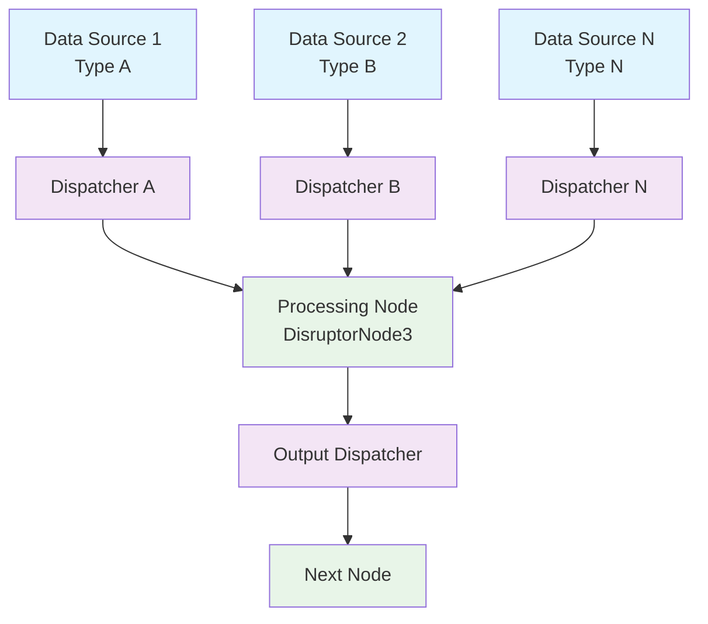

# Conduit - Reactive Dispatcher Framework

## Overview

Conduit is a high-performance, low-latency reactive framework built on top of the LMAX Disruptor. It provides a type-safe, fluent API for building event-driven data processing pipelines that can handle multiple input sources with different data types.

## Architecture

### Core Components

#### 1. Dispatcher

The `Dispatcher` interface is responsible for dispatching events to registered listeners.

```java
public interface Dispatcher<T> {
    void dispatch(T event);
    void register(Listener<T> listener);
    void unregister(Listener<T> listener);
    void clear();
}
```

**EventDispatcher Implementation:**

```java
EventDispatcher<Integer> intDispatcher = EventDispatcher.create();
EventDispatcher<String> stringDispatcher = EventDispatcher.create();
```

#### 2. Node

Nodes are processing components that subscribe to one or more dispatchers and handle events through callback methods.

**Node Types:**

- `Node1` to `Node9` - Plain implementations (multi-threaded event handling)
- `DisruptorNode1` to `DisruptorNode9` - Disruptor-based implementations (single-threaded, lock-free)

### Architecture Diagram



## Basic Usage

### Simple Two-Input Node

```java
import io.lightning.conduit.dispatcher.EventDispatcher;
import io.lightning.conduit.node.DisruptorNode2;

public class CombineNode extends DisruptorNode2<Integer, String> {
    @Override
    protected void onEvent1(Integer event) {
        System.out.println("Received integer: " + event);
    }

    @Override
    protected void onEvent2(String event) {
        System.out.println("Received string: " + event);
    }
}

// Usage
EventDispatcher<Integer> intDispatcher = EventDispatcher.create();
EventDispatcher<String> stringDispatcher = EventDispatcher.create();

CombineNode combineNode = new CombineNode();
combineNode.subscribe1(intDispatcher);
combineNode.subscribe2(stringDispatcher);
combineNode.start();

// Dispatch events
intDispatcher.dispatch(42);
stringDispatcher.dispatch("Hello, Conduit!");
```

### Financial Data Processing Example

```java
public class FinancialProcessor extends DisruptorNode3<Price, Rate, Volume> {
    private double currentPrice;
    private double currentRate;
    private long currentVolume;

    @Override
    protected void onEvent1(Price price) {
        currentPrice = price.getValue();
        calculateMetrics();
    }

    @Override
    protected void onEvent2(Rate rate) {
        currentRate = rate.getValue();
        calculateMetrics();
    }

    @Override
    protected void onEvent3(Volume volume) {
        currentVolume = volume.getAmount();
        calculateMetrics();
    }

    private void calculateMetrics() {
        // Combine all inputs to calculate trading metrics
        double metric = currentPrice * currentRate * currentVolume;
        System.out.println("Calculated metric: " + metric);
    }
}

// Setup
EventDispatcher<Price> priceDispatcher = EventDispatcher.create();
EventDispatcher<Rate> rateDispatcher = EventDispatcher.create();
EventDispatcher<Volume> volumeDispatcher = EventDispatcher.create();

FinancialProcessor processor = new FinancialProcessor();
processor.subscribe1(priceDispatcher)
         .subscribe2(rateDispatcher)
         .subscribe3(volumeDispatcher);
processor.start();
```

## Node Types Comparison

### Plain Node (Node2)

**Characteristics:**
- Each event handler runs on the dispatcher's thread
- If two dispatchers call from different threads, handlers can run concurrently
- No built-in synchronization

**Best for:**
- Independent event handlers with no shared state
- Maximum parallelism across multiple CPU cores
- CPU-bound processing where each handler can run independently

### Disruptor Node (DisruptorNode2)

**Characteristics:**
- All events processed in a single thread (lock-free)
- Events from all sources go through the Disruptor ring buffer
- Guaranteed ordering and no race conditions

**Best for:**
- Handlers that share state
- Low-latency requirements
- Need to coordinate or order events from different sources
- Lightweight, fast processing

## Fluent API

The Conduit framework provides a fluent API for easy pipeline construction:

```java
DisruptorNode3<Price, Rate, Volume> processor = new FinancialProcessor();

processor
    .subscribe1(priceDispatcher)
    .subscribe2(rateDispatcher)
    .subscribe3(volumeDispatcher)
    .start();
```

## Configuration

### Disruptor Settings

DisruptorNodes can be configured with custom settings:

```java
public class CustomNode extends DisruptorNode2<Integer, String> {
    public CustomNode() {
        super(
            1024,  // Ring buffer size (must be power of 2)
            new BusySpinWaitStrategy()  // Wait strategy
        );
    }

    // ... event handlers
}
```

### Wait Strategies

Choose based on your latency vs. CPU usage trade-off:

| Strategy | Latency | CPU Usage | Use Case |
|----------|---------|-----------|----------|
| BusySpinWaitStrategy | Lowest | Highest | Ultra-low latency trading |
| YieldingWaitStrategy | Low | High | Low latency, some CPU yield |
| SleepingWaitStrategy | Medium | Medium | Balanced applications |
| BlockingWaitStrategy | Highest | Lowest | CPU-conscious applications |

## Advanced Patterns

### Pipeline Chaining

Create complex processing pipelines by chaining nodes:

```java
// Stage 1: Data ingestion
DisruptorNode2<RawData1, RawData2> ingestionNode = new IngestionNode();

// Stage 2: Data enrichment
EventDispatcher<EnrichedData> enrichedDispatcher = EventDispatcher.create();
DisruptorNode1<EnrichedData> enrichmentNode = new EnrichmentNode();

// Stage 3: Analytics
DisruptorNode1<AnalyticsResult> analyticsNode = new AnalyticsNode();

// Connect the pipeline
ingestionNode.subscribe1(rawData1Dispatcher)
             .subscribe2(rawData2Dispatcher);
ingestionNode.start();

enrichmentNode.subscribe1(enrichedDispatcher);
enrichmentNode.start();

analyticsNode.subscribe1(analyticsDispatcher);
analyticsNode.start();
```

### Fan-out Pattern

Distribute events to multiple consumers:

```java
EventDispatcher<MarketData> marketDataDispatcher = EventDispatcher.create();

// Multiple nodes subscribe to the same dispatcher
DisruptorNode1<MarketData> riskNode = new RiskCalculationNode();
DisruptorNode1<MarketData> analyticsNode = new AnalyticsNode();
DisruptorNode1<MarketData> auditNode = new AuditNode();

riskNode.subscribe1(marketDataDispatcher).start();
analyticsNode.subscribe1(marketDataDispatcher).start();
auditNode.subscribe1(marketDataDispatcher).start();
```

## Error Handling

Implement error handling in your event handlers:

```java
public class RobustNode extends DisruptorNode2<Integer, String> {
    @Override
    protected void onEvent1(Integer event) {
        try {
            // Process event
            processInteger(event);
        } catch (Exception e) {
            handleError(e, event);
        }
    }

    private void handleError(Exception e, Object event) {
        // Log error, send to dead letter queue, etc.
        logger.error("Error processing event: " + event, e);
    }
}
```

## Best Practices

1. **Choose the Right Node Type**
   - Use `DisruptorNode` for low-latency, ordered processing
   - Use plain `Node` for independent, parallel processing

2. **Keep Event Handlers Fast**
   - Avoid blocking operations (I/O, network calls)
   - Offload heavy computations to worker threads if needed

3. **Pre-allocate Resources**
   - Initialize objects in constructor, not in event handlers
   - Reuse objects to minimize GC pressure

4. **Monitor Performance**
   - Track event processing time
   - Monitor ring buffer fullness
   - Watch for backpressure

5. **Graceful Shutdown**
   - Implement proper lifecycle management
   - Drain remaining events before shutdown

## Lifecycle Management

```java
// Start processing
node.start();

// Shutdown gracefully
node.shutdown();
```

## Dependencies

```xml
<dependencies>
    <dependency>
        <groupId>com.lmax</groupId>
        <artifactId>disruptor</artifactId>
        <version>4.0.0</version>
    </dependency>
    <dependency>
        <groupId>org.slf4j</groupId>
        <artifactId>slf4j-api</artifactId>
        <version>2.0.9</version>
    </dependency>
</dependencies>
```

## Next Steps

- [Performance Comparison](performance.md) - Detailed performance analysis
- [Example Applications](examples.md) - Real-world usage examples
- [LMAX Disruptor Overview](index.md) - Learn about the underlying technology
