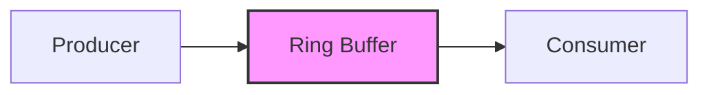
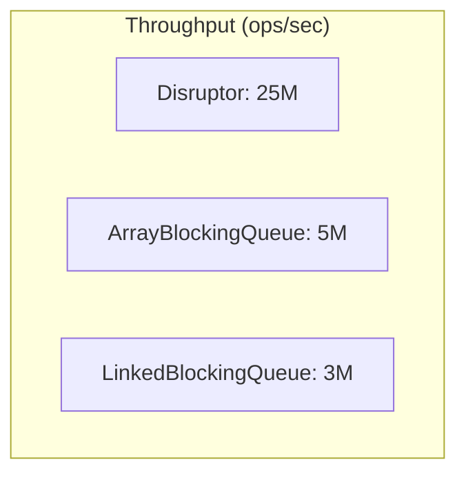

# LMAX Disruptor & Conduit Framework

## Overview

The LMAX Disruptor is a high-performance inter-thread messaging library that provides a simple yet powerful framework for exchanging data between threads. It is designed for low-latency, high-throughput scenarios where traditional queuing mechanisms introduce too much overhead.

The **Conduit** framework builds on top of the LMAX Disruptor to provide a reactive, event-driven architecture for building complex data processing pipelines.

## What is the LMAX Disruptor?

The LMAX Disruptor is a library that enables very high performance concurrent programming. It was developed by LMAX Exchange, a financial trading platform that required extremely low-latency message passing between threads.

### Key Features

- **Lock-free**: Uses CAS (Compare-And-Swap) operations instead of locks
- **Ring Buffer**: Pre-allocated circular buffer eliminates garbage collection overhead
- **Memory Barriers**: Carefully controlled memory visibility without locks
- **Cache-friendly**: Data structures designed to minimize cache line contention
- **Batching**: Naturally supports batch processing of events

### Core Concepts

#### Ring Buffer
A fixed-size circular buffer that holds references to events. It's pre-allocated at startup, which eliminates memory allocation during runtime.



#### Sequence Numbers
Used to track positions in the ring buffer. Producers claim sequence numbers before writing, and consumers track which events they've processed.

#### Wait Strategies
Different strategies for consumers waiting for new events:

- **BusySpinWaitStrategy**: Lowest latency, highest CPU usage
- **YieldingWaitStrategy**: Low latency with some CPU yield
- **SleepingWaitStrategy**: Lower CPU usage, higher latency
- **BlockingWaitStrategy**: Lowest CPU usage, highest latency

## Why Use Disruptor?

### Traditional Queue Problems

Traditional concurrent queues (like `java.util.concurrent` queues) suffer from:

1. **Lock Contention**: Multiple threads competing for locks
2. **Cache Coherency**: False sharing and cache line bouncing
3. **Memory Allocation**: Creating/destroying objects causes GC pressure
4. **Context Switching**: Blocking operations cause thread context switches

### Disruptor Solutions

| Problem | Disruptor Solution |
|---------|-------------------|
| Lock Contention | Lock-free algorithms using CAS |
| Cache Coherency | Cache line padding to prevent false sharing |
| Memory Allocation | Pre-allocated ring buffer |
| Context Switching | Busy-spin wait strategies |

## Performance Characteristics

The Disruptor can process **millions of events per second** with **nanosecond latencies** on modern hardware.

### Benchmark Comparison



## Common Use Cases

1. **Financial Trading Systems**: Ultra-low latency order processing
2. **Real-time Analytics**: High-throughput data stream processing
3. **Event Sourcing**: Recording domain events in order
4. **Log Aggregation**: Collecting and processing log entries
5. **IoT Data Processing**: Handling sensor data streams

## Getting Started

To use the Disruptor in your project, add the dependency:

```xml
<dependency>
    <groupId>com.lmax</groupId>
    <artifactId>disruptor</artifactId>
    <version>4.0.0</version>
</dependency>
```

## Next Steps

- [Conduit Framework Overview](conduit-framework.md) - Learn about the reactive framework built on Disruptor
- [Performance Comparison](performance.md) - Detailed performance analysis
- [Example Applications](examples.md) - Real-world usage examples

## Resources

- [LMAX Disruptor GitHub](https://github.com/LMAX-Exchange/disruptor)
- [Technical Paper](https://lmax-exchange.github.io/disruptor/disruptor.html)
- [Martin Fowler's Article](https://martinfowler.com/articles/lmax.html)
