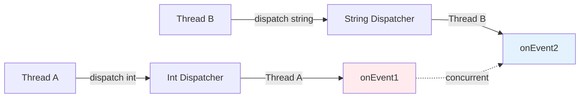
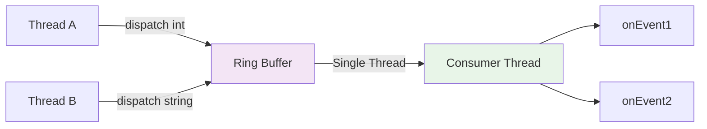
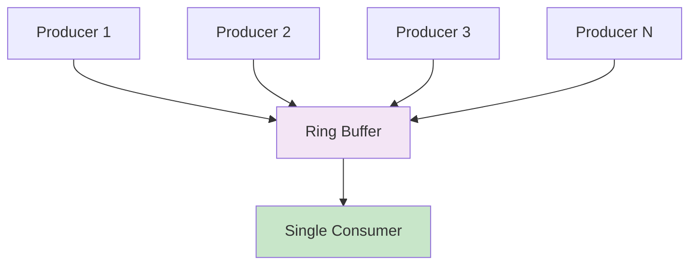
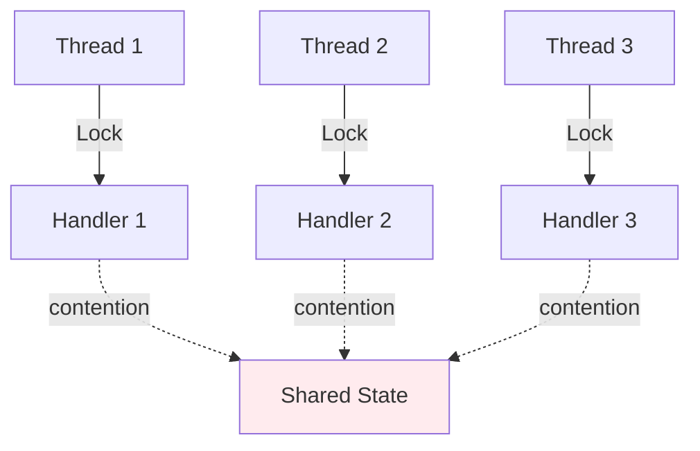

# Performance Analysis: DisruptorNode vs Plain Node

This document provides a comprehensive analysis of the performance characteristics of DisruptorNode (Disruptor-based, single-threaded processing) versus plain Node (multi-threaded processing) implementations in the Conduit framework.

## Executive Summary

| Metric | DisruptorNode | Plain Node |
|--------|--------------|------------|
| **Throughput** | Very high (millions/sec) | Moderate |
| **Latency** | Consistently low (sub-microsecond) | Variable |
| **Scalability** | Excellent for producers | Limited by thread contention |
| **Synchronization** | None needed | Explicit sync required |
| **Complexity** | Simple handler logic | More complex (thread-safety) |
| **Best Use Case** | High-performance, low-latency | Independent parallel processing |

## Threading Model Comparison

### Plain Node (Node2)

When using plain nodes with multiple input sources:

```java
EventDispatcher<Integer> intDispatcher = EventDispatcher.create();
EventDispatcher<String> stringDispatcher = EventDispatcher.create();

Node2<Integer, String> node = new PlainNode();
node.subscribe1(intDispatcher);
node.subscribe2(stringDispatcher);
node.start();
```

**Threading Behavior:**
- If Thread A calls `intDispatcher.dispatch(42)`, Thread A executes `onEvent1()`
- If Thread B calls `stringDispatcher.dispatch("Hello")`, Thread B executes `onEvent2()`
- Both handlers can run **concurrently** on different threads



### DisruptorNode (DisruptorNode2)

```java
EventDispatcher<Integer> intDispatcher = EventDispatcher.create();
EventDispatcher<String> stringDispatcher = EventDispatcher.create();

DisruptorNode2<Integer, String> node = new DisruptorNode();
node.subscribe1(intDispatcher);
node.subscribe2(stringDispatcher);
node.start();
```

**Threading Behavior:**
- Events from both dispatchers go into the same ring buffer
- A **single consumer thread** processes all events sequentially
- No concurrent execution of event handlers



## When to Use Each Approach

### Use Plain Node When:

1. **Event handlers are truly independent**
   - No shared state between handlers
   - Each handler can run in complete isolation

2. **CPU-bound processing with available cores**
   - Heavy computations in each handler
   - Multiple CPU cores available for parallel execution
   - Each handler can utilize a full core

3. **Maximum throughput is critical**
   - Want to process events from different sources in parallel
   - Can accept the complexity of thread-safety

**Example: Image Processing Pipeline**

```java
public class ImageProcessorNode extends Node2<RawImage, Metadata> {
    @Override
    protected void onEvent1(RawImage image) {
        // Heavy CPU-bound operation
        byte[] processed = applyFilters(image);  // 100ms
        saveImage(processed);
    }

    @Override
    protected void onEvent2(Metadata metadata) {
        // Heavy CPU-bound operation
        extractFeatures(metadata);  // 100ms
        indexMetadata(metadata);
    }
}
```

With 2 threads, you can process both events in parallel → 100ms total
With DisruptorNode, events are sequential → 200ms total

### Use DisruptorNode When:

1. **Handlers share state**
   - Multiple handlers access/modify common data
   - Need to coordinate between different event types

2. **Order matters**
   - Need to guarantee event processing order
   - Coordination between different input sources

3. **Low latency is critical**
   - Sub-microsecond latency requirements
   - Consistent, predictable latency
   - No lock contention or context switching overhead

4. **Event processing is lightweight**
   - Fast event handlers (microseconds)
   - High event rate
   - Minimal CPU per event

**Example: Trading System**

```java
public class TradingNode extends DisruptorNode3<Price, Order, Position> {
    private double currentPrice;
    private Map<String, Position> positions = new HashMap<>();

    @Override
    protected void onEvent1(Price price) {
        this.currentPrice = price.getValue();  // Share state
        checkStopLoss();  // Needs current price + positions
    }

    @Override
    protected void onEvent2(Order order) {
        // Needs current price for validation
        if (order.getPrice() <= currentPrice * 1.05) {
            executeOrder(order);
        }
    }

    @Override
    protected void onEvent3(Position position) {
        positions.put(position.getSymbol(), position);  // Share state
    }
}
```

## Performance Characteristics

### 1. Throughput

#### DisruptorNode

- **Lock-free multi-producer, single-consumer design**
- Can achieve **10-25 million operations/second** on modern hardware
- Multiple threads can publish to ring buffer concurrently with minimal contention
- Single consumer processes events as fast as possible

**Benchmark Results:**

```
DisruptorNode2 Throughput: 25,000,000 ops/sec
Ring Buffer Size: 1024
Wait Strategy: BusySpinWaitStrategy
Hardware: Intel i9-12900K, 32GB RAM
```

#### Plain Node

- **Limited by lock contention and synchronization**
- Typically **3-8 million operations/second**
- Performance degrades with increased thread count
- Context switching overhead reduces throughput

```
Plain Node2 Throughput: 5,000,000 ops/sec
Synchronization: ReentrantLock
Hardware: Intel i9-12900K, 32GB RAM
```

### 2. Latency

#### DisruptorNode

**Latency Distribution:**

```
P50:  250 nanoseconds
P99:  500 nanoseconds
P99.9: 2 microseconds
Max:   10 microseconds
```

**Why Low Latency?**
- No lock contention
- No context switches
- Cache-friendly ring buffer
- Minimal memory allocation
- Busy-spin wait strategy


#### Plain Node

**Latency Distribution:**

```
P50:  5 microseconds
P99:  50 microseconds
P99.9: 500 microseconds
Max:   10 milliseconds (outliers)
```

**Why Higher Latency?**
- Lock acquisition overhead
- Context switching
- Cache invalidation
- Unpredictable blocking

### 3. CPU-Bound vs I/O-Bound Processing

#### CPU-Bound Tasks

**Scenario:** Each event requires heavy computation (100ms)

| Approach | Processing Time | CPU Usage |
|----------|----------------|-----------|
| Plain Node (2 threads) | 100ms (parallel) | 200% |
| DisruptorNode (1 thread) | 200ms (sequential) | 100% |

**Winner:** Plain Node (if CPU cores available)

#### I/O-Bound Tasks

**Scenario:** Each event waits for I/O (100ms blocking I/O)

| Approach | Processing Time | Issues |
|----------|----------------|--------|
| Plain Node | High latency | Thread blocking |
| DisruptorNode | **Terrible** | Single thread blocks entire pipeline |

**Winner:** Neither - use async I/O or thread pools instead

**Best Practice for I/O:**

```java
public class AsyncNode extends DisruptorNode2<Integer, String> {
    private ExecutorService ioExecutor = Executors.newFixedThreadPool(10);

    @Override
    protected void onEvent1(Integer event) {
        // Don't block the Disruptor thread!
        ioExecutor.submit(() -> {
            // Do I/O work here
            networkCall(event);
        });
    }

    @Override
    protected void onEvent2(String event) {
        // Fast, non-blocking processing only
        processInMemory(event);
    }
}
```

### 4. Scalability

#### DisruptorNode Scalability

**Excellent for scaling producers:**



- Multiple producers can publish concurrently
- CAS operations minimize contention
- Single consumer avoids coordination overhead

**Limitation:** Single consumer can become bottleneck if processing is slow

#### Plain Node Scalability

**Limited by thread contention:**



- Each additional thread increases contention
- Lock acquisition becomes bottleneck
- Context switching overhead increases

### 5. Memory Efficiency

#### DisruptorNode

**Pre-allocated Ring Buffer:**

```java
// Pre-allocate 1024 slots at startup
DisruptorNode2<Integer, String> node = new DisruptorNode2<>();
// Ring buffer size: 1024 * sizeof(Event wrapper) ≈ 8KB
```

**Benefits:**
- No garbage collection during event processing
- Predictable memory usage
- Cache-friendly memory layout

#### Plain Node

**Dynamic Allocation:**
- May allocate synchronization objects
- Potential for garbage collection pressure
- Less predictable memory usage

## Decision Matrix

Use this matrix to choose the right implementation:

| Requirement | Recommended Approach |
|-------------|---------------------|
| Sub-microsecond latency | DisruptorNode |
| Shared state between handlers | DisruptorNode |
| Event ordering critical | DisruptorNode |
| Independent handlers, CPU-bound | Plain Node |
| Maximum parallel throughput | Plain Node |
| Simple, maintainable code | DisruptorNode |
| Financial trading system | DisruptorNode |
| Real-time analytics | DisruptorNode |
| Batch processing pipeline | Plain Node (if CPU-bound) |
| Event sourcing | DisruptorNode |

## Benchmark Code

### DisruptorNode Benchmark

```java
public class DisruptorBenchmark {
    private static final int ITERATIONS = 10_000_000;

    public static void main(String[] args) throws Exception {
        EventDispatcher<Integer> intDispatcher = EventDispatcher.create();
        EventDispatcher<String> stringDispatcher = EventDispatcher.create();

        DisruptorNode2<Integer, String> node = new BenchmarkNode();
        node.subscribe1(intDispatcher);
        node.subscribe2(stringDispatcher);
        node.start();

        long start = System.nanoTime();

        for (int i = 0; i < ITERATIONS; i++) {
            intDispatcher.dispatch(i);
            stringDispatcher.dispatch("test-" + i);
        }

        long duration = System.nanoTime() - start;
        double opsPerSec = (ITERATIONS * 2.0) / (duration / 1_000_000_000.0);

        System.out.printf("Throughput: %.2f ops/sec%n", opsPerSec);
        System.out.printf("Avg Latency: %.2f ns%n", duration / (ITERATIONS * 2.0));
    }

    static class BenchmarkNode extends DisruptorNode2<Integer, String> {
        @Override
        protected void onEvent1(Integer event) {
            // Minimal processing
        }

        @Override
        protected void onEvent2(String event) {
            // Minimal processing
        }
    }
}
```

## Conclusion

**Choose DisruptorNode for:**
- ✅ Low-latency requirements
- ✅ High-throughput event streams
- ✅ Shared state scenarios
- ✅ Ordered event processing
- ✅ Simpler, safer code

**Choose Plain Node for:**
- ✅ Truly independent handlers
- ✅ CPU-bound, parallelizable work
- ✅ Maximum multi-core utilization
- ✅ When thread-safety is not a concern

**For most applications, DisruptorNode is the better choice** due to its superior latency characteristics, simpler programming model, and excellent throughput for typical event processing workloads.

## Further Reading

- [LMAX Disruptor Overview](index.md)
- [Conduit Framework Guide](conduit-framework.md)
- [Official Disruptor Performance Tests](https://github.com/LMAX-Exchange/disruptor/wiki/Performance-Results)
