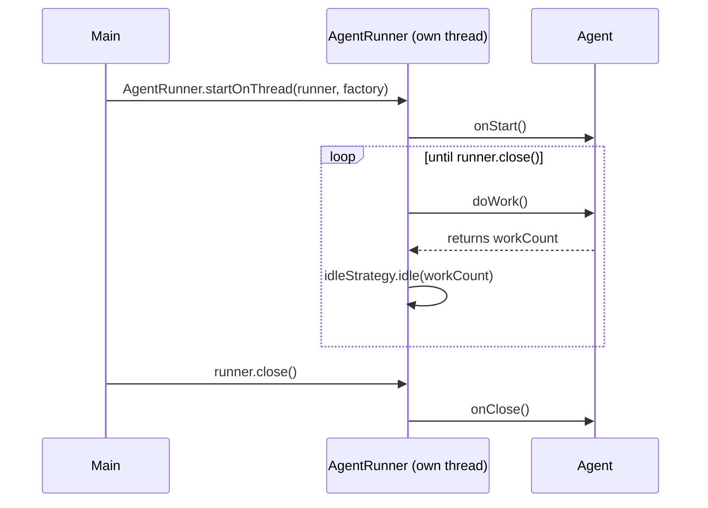

# Agrona's Agent Pattern, Explained

Both [the leak-to-OOM case study](gc-leak-oom.md) and [the healthy-churn case study](gc-survivor-demo.md)
use Agrona's `Agent`/`AgentRunner` pattern to drive their demo workload. This page explains that
pattern from scratch — read it first if `Agent`, `doWork()`, `AgentRunner`, or `IdleStrategy` are
new terms to you.

---

## 1. The problem this solves

You often need "a unit of work, done repeatedly, on its own thread, until told to stop." Without a
shared pattern, every service ends up hand-rolling its own version of:

```java
new Thread(() -> {
    while (!closed) {
        doSomething();
        Thread.sleep(someInterval); // or busy-loop, or something ad-hoc
    }
}).start();
```

— with slightly different (and often subtly buggy) shutdown handling, error handling, and
CPU-usage tradeoffs every time. Agrona's `Agent` + `AgentRunner` factors all of that into two
small, reusable pieces.

## 2. The `Agent` interface

```java
public interface Agent {
    default void onStart() {}
    int doWork() throws Exception;
    default void onClose() {}
    String roleName();
}
```

| Method | Called | Purpose |
|---|---|---|
| `onStart()` | Once, right after the agent's thread starts | One-time setup (e.g. record a start timestamp) |
| `doWork()` | Repeatedly, in a tight loop, for the agent's whole lifetime | Do one small unit of work, then return |
| `onClose()` | Once, when the runner is closed | One-time teardown |
| `roleName()` | Whenever the runner needs a name for the thread | Just a label — this is what shows up as the thread name in `jstack`/VisualVM |

**The contract that matters most: `doWork()`'s return value.** Return a positive number to mean
"I did something," or `0` to mean "nothing to do right now." This isn't just informational — it
directly controls how the `AgentRunner`'s `IdleStrategy` behaves (see §4). Every agent in both
case studies uses the same self-timing shape to implement this:

```java
private long nextFireNs;

public int doWork() {
    final long now = System.nanoTime();
    if (now < nextFireNs) {
        return 0; // too early — nothing to do, let the idle strategy back off
    }
    // ...do the actual work...
    nextFireNs = now + INTERVAL_NS;
    return 1; // did work
}
```

## 3. `AgentRunner` — the loop around your `Agent`

```java
AgentRunner runner = new AgentRunner(
    idleStrategy,     // what to do when doWork() returns 0
    errorHandler,     // what to do if doWork() throws a checked Exception
    errorCounter,     // optional AtomicCounter to increment on error — null is fine
    agent);           // your Agent implementation

AgentRunner.startOnThread(runner, threadFactory);
```

Internally, `AgentRunner.run()` is essentially:

```java
agent.onStart();
while (!closed) {
    try {
        int workCount = agent.doWork();
        idleStrategy.idle(workCount);
    } catch (Exception e) {
        errorHandler.onError(e); // and increments errorCounter, if one was given
    }
}
agent.onClose();
```



!!! warning "An uncaught `Error` doesn't go through `errorHandler`"
    Look closely at the `catch` above: it's `catch (Exception e)`, matching `Agent.doWork()`'s
    `throws Exception` signature. An `Error` — like `OutOfMemoryError` — is not an `Exception` and
    is not caught here at all. It escapes straight past `AgentRunner` and is handled by the JVM's
    default uncaught-exception handler instead, which is exactly what happens in the
    [leak-to-OOM case study](gc-leak-oom.md#8-the-demo-itself) — the `errorHandler` you pass in
    never sees the `OutOfMemoryError` that ends that demo.

## 4. `IdleStrategy` — what happens when there's nothing to do

| Strategy | Behavior when idle | CPU cost | Use when |
|---|---|---|---|
| `BusySpinIdleStrategy` | Spins in a tight loop, does nothing else | Pins a full core at 100% | Ultra-low latency — you're willing to burn a whole core to react in nanoseconds |
| `YieldingIdleStrategy` | Calls `Thread.yield()` | Moderate | A middle ground — still fast to react, gives the scheduler a chance to run other threads |
| `SleepingIdleStrategy` | Sleeps for a fixed duration | Low | General purpose — what both GC case studies use |
| `BackoffIdleStrategy` | Spins, then yields, then sleeps with increasing duration | Adapts | General purpose, avoids the fixed-latency floor of always sleeping the same amount |

Both case studies use `SleepingIdleStrategy(TimeUnit.___.toNanos(N))` — the constructor argument
is the sleep duration used **every time `doWork()` returns 0**, regardless of how each agent
paces its own actual work internally via `nextFireNs`. This distinction matters and is easy to
get wrong:

- The agent's own `INTERVAL_NS` field controls **how often real work happens** (e.g. once every
  10 seconds for `LeakyAgent`, every 5ms for `SurvivorDemoAgent`).
- The `IdleStrategy`'s sleep duration controls **how often `doWork()` gets called at all** to
  *check* whether it's time yet.

If the idle-sleep duration is coarser than the agent's own interval, the actual firing will lag
and jitter by up to the sleep duration — this was observed directly early in this series:
`StringAllocatorAgent` targeted exactly 1 second between ticks but used a 100ms idle sleep, and
the actual gaps between console log timestamps came out as `1.029s`, `1.039s`, etc. — jitter on
the order of the idle-sleep granularity, not the target interval. `SurvivorDemoAgent` needed a
much finer `500-microsecond` idle sleep specifically because its own interval (5ms) is so much
shorter — a 100ms idle sleep would have made a 5ms target interval meaningless.

## 5. The daemon-thread pitfall

```java
AgentRunner.startOnThread(runner);                    // does NOT create a daemon thread
AgentRunner.startOnThread(runner, threadFactory);      // daemon-ness is whatever the factory makes
```

The no-argument overload uses `Thread::new` as its `ThreadFactory`. A thread made with
`new Thread(...)` inherits daemon-ness from **the thread that created it** — since `main` is
non-daemon, an agent started this way is non-daemon too, and would keep the JVM alive even if
nothing else is happening. Confirmed by decompiling `AgentRunner.class`: the no-arg overload's
bytecode only calls `setName(roleName())` and `start()` — no `setDaemon()` anywhere.

Both case studies use the explicit factory form to guarantee a daemon thread:

```java
AgentRunner.startOnThread(runner, runnable -> {
    Thread thread = new Thread(runnable);
    thread.setDaemon(true);
    return thread;
});
```

## 6. Seeing it in a real thread dump

Whatever you pass to `roleName()` becomes the actual OS thread name — this is exactly why
`jstack`/VisualVM show threads named `leaky-agent` and `survivor-demo` in the case studies,
instead of an anonymous `Thread-0`. It's one line (`AgentRunner.startOnThread` calls
`thread.setName(agent.roleName())` internally) but it's what makes an agent's thread
identifiable at a glance in any tool that lists threads.

## Related

- [GC Deep Dive: Leak to OOM](gc-leak-oom.md) — `LeakyAgent`, built on everything above.
- [GC Case Study: Healthy Churn](gc-survivor-demo.md) — `SurvivorDemoAgent`, same pattern, much
  shorter interval.
- [Shutdown Mechanisms](shutdown.md) — `ShutdownSignalBarrier`, the other half of how these demos
  start and stop cleanly.
