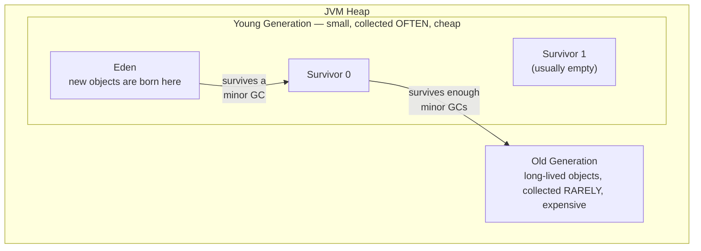
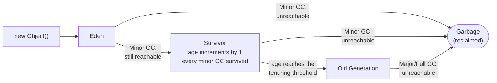
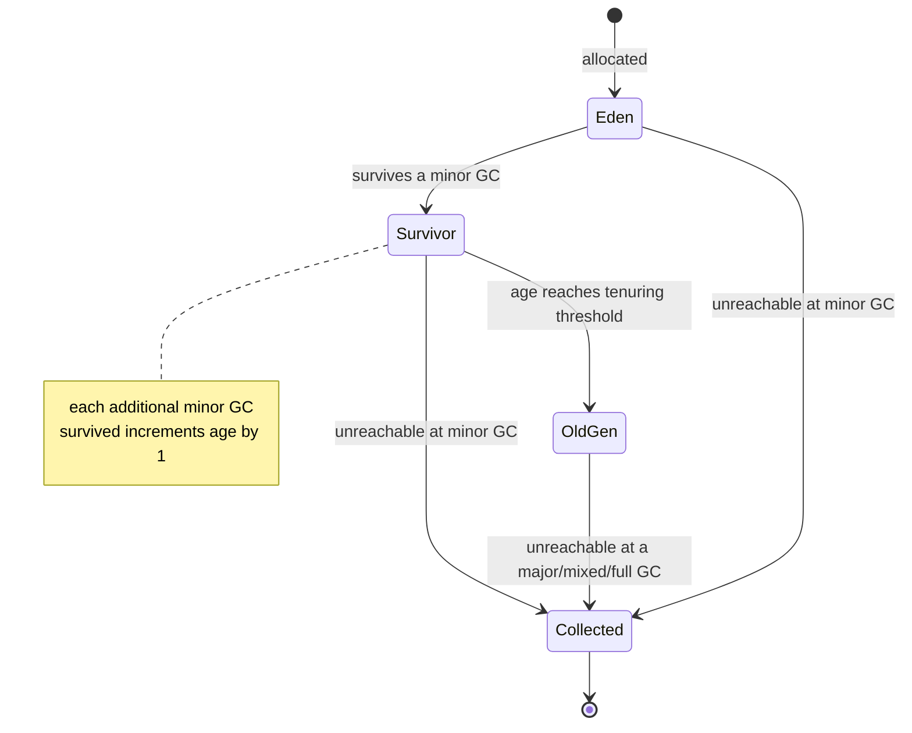
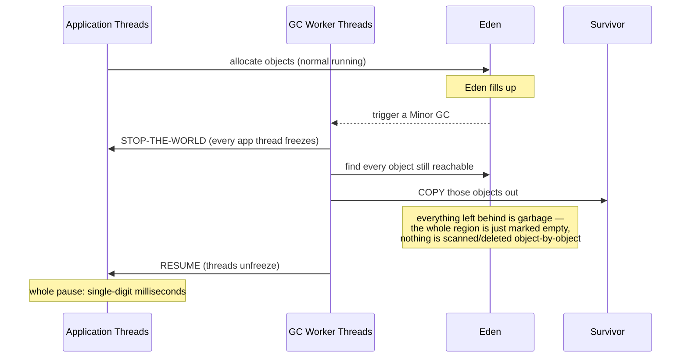
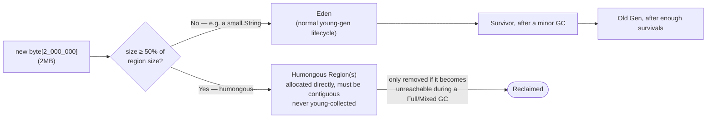
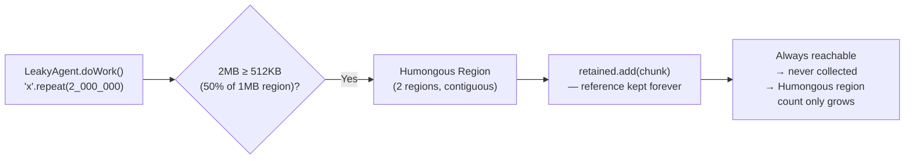

# GC Basics, Visually

Garbage collection explained from zero, one diagram at a time — generations, Eden, Survivor,
promotion, and how G1 (the modern default collector) reshapes all of it into regions. This is the
prerequisite page for [GC Deep Dive: Leak to OOM](gc-leak-oom.md), which uses everything here to
read a real GC log.

---

## 1. The heap at a glance

The JVM heap isn't one big undifferentiated blob — it's split into areas with different jobs.

(This diagram simplifies to one path, Eden → Survivor 0 → Old, to keep the big picture clean —
`Survivor 1`'s role, and why there are really two of them, is explained in §4 below.)

Why split it up at all? Because of one observation that holds true almost everywhere:
**most objects die young.** A loop-local variable, a temp string, a formatting buffer — nearly
all garbage is created and discarded within milliseconds. Long-lived objects (caches, config,
connection pools) are the rare exception. So the collector optimizes for the common case: a
small, cheap, frequently-collected young area, and a big, expensive, rarely-touched old area for
the few things that actually stick around.

---

## 2. An object's life story

Every object goes through the same possible journey. Most never make it past step 1.

The same story as a state machine — useful if you think in terms of "what state is this object in
right now":

**Reachable** just means: is there a path from a GC root (a local variable on some thread's
stack, a static field, etc.) to this object, following references? If yes, it survives. If no
path exists anymore, it's garbage — free to reclaim.

---

## 3. Anatomy of one Minor GC

This is what actually happens, moment to moment, when Eden fills up:

Two things worth internalizing here:

- **"Stop-the-world" is literal.** Every application thread — not just the one that triggered the
  GC — freezes for the pause's duration. Only GC worker threads run.
- **This is a copying collector, not a sweeping one.** The GC never "deletes" garbage
  individually — it only ever copies the *survivors* elsewhere, then treats the entire
  now-empty-of-live-objects region as free space to reuse. That's precisely why minor GCs are
  cheap: cost is proportional to how much survives, not to how much garbage there is.

!!! note "What \"Eden fills up\" actually means"
    It's not "every byte is used" — it's **"the next allocation can't be satisfied."** Most
    allocation doesn't touch shared/global state at all: each thread owns a private slice of an
    Eden region called a **TLAB** (Thread-Local Allocation Buffer), and allocating inside it is
    just `pointer += objectSize` — a bump of a pointer, no locking, no coordination with other
    threads. That's why Java allocation is so cheap.

    Eden is only "full" at the moment a thread's bump-pointer reaches the end of its TLAB and it
    asks for a **new** one — and there isn't enough contiguous free space left across the regions
    currently labeled Eden to hand one out. That request is the one synchronization point where
    the JVM checks shared state, and its failure is what triggers the Minor GC above. In G1
    specifically, since Eden is a set of separate regions rather than one block, "full" means
    every region currently labeled Eden has no room left, *and* G1 has no free region left to
    relabel as Eden either.

---

## 4. Why there are *two* Survivor spaces

This trips people up: the young generation actually has Eden + **two** Survivor spaces (often
drawn as S0/S1), and at any given moment one of them is always empty. They swap roles every
collection.

<table style="border-collapse:separate;border-spacing:8px;text-align:center;font-family:inherit;">
<tr>
<th style="text-align:left;padding-right:12px;font-weight:600;"></th>
<th style="font-weight:600;">Eden</th>
<th style="font-weight:600;">Survivor A</th>
<th style="font-weight:600;">Survivor B</th>
</tr>
<tr>
<td style="text-align:left;font-weight:600;padding-right:12px;">Before Minor GC #1</td>
<td style="background:#8fd694;border:1px solid #2f6f3e;color:#0a0a0a;padding:10px;">full</td>
<td style="background:#e8e8e8;border:1px solid #aaaaaa;color:#555555;padding:10px;">empty</td>
<td style="background:#e8e8e8;border:1px solid #aaaaaa;color:#555555;padding:10px;">empty</td>
</tr>
<tr>
<td style="text-align:left;font-weight:600;padding-right:12px;">After Minor GC #1</td>
<td style="background:#e8e8e8;border:1px solid #aaaaaa;color:#555555;padding:10px;">empty</td>
<td style="background:#f4d35e;border:1px solid #9c7a1c;color:#0a0a0a;padding:10px;">holds survivors</td>
<td style="background:#e8e8e8;border:1px solid #aaaaaa;color:#555555;padding:10px;">still empty</td>
</tr>
<tr>
<td style="text-align:left;font-weight:600;padding-right:12px;">After Minor GC #2</td>
<td style="background:#e8e8e8;border:1px solid #aaaaaa;color:#555555;padding:10px;">empty</td>
<td style="background:#e8e8e8;border:1px solid #aaaaaa;color:#555555;padding:10px;">now empty</td>
<td style="background:#f4d35e;border:1px solid #9c7a1c;color:#0a0a0a;padding:10px;">holds survivors</td>
</tr>
</table>

*Survivor B now holds both the objects that were in Survivor A and anything newly promoted from
Eden — everything gets copied together into whichever Survivor space is currently empty.*

Why bother with two? Because copying collectors need somewhere *empty* to copy into. Each
collection, everything currently alive in Eden **and** in the currently-occupied Survivor space
gets copied together into the *other*, currently-empty Survivor space. This is also where the
"age" counter comes from: every time an object gets copied across this A→B→A→B swap and is still
reachable, its age increments. Once it crosses the tenuring threshold (a JVM-tunable number of
survived collections), it gets promoted to Old gen instead of copied again.

---

## 5. G1: the heap isn't one big block, it's a grid of regions

Everything above describes the *classic* generational model (used by the older Serial/Parallel
collectors), where Eden/Survivor/Old are each one contiguous chunk of memory. **G1 (the default
since JDK 9) throws that layout away.** It chops the whole heap into many fixed-size **regions**,
and labels each region's *role* dynamically — there's no longer one "the Eden," there are *N
regions currently acting as Eden*, and that number changes collection to collection.

<table style="border-collapse:separate;border-spacing:8px;text-align:center;font-family:inherit;">
<tr>
<td style="background:#8fd694;border:1px solid #2f6f3e;color:#0a0a0a;width:64px;height:48px;">E</td>
<td style="background:#8fd694;border:1px solid #2f6f3e;color:#0a0a0a;width:64px;height:48px;">E</td>
<td style="background:#f4d35e;border:1px solid #9c7a1c;color:#0a0a0a;width:64px;height:48px;">S</td>
<td style="background:#7a9cc6;border:1px solid #39537a;color:#0a0a0a;width:64px;height:48px;">O</td>
</tr>
<tr>
<td style="background:#7a9cc6;border:1px solid #39537a;color:#0a0a0a;">O</td>
<td style="background:#e26d5c;border:1px solid #8f3a2c;color:#ffffff;">H</td>
<td style="background:#e26d5c;border:1px solid #8f3a2c;color:#ffffff;">H</td>
<td style="background:#8fd694;border:1px solid #2f6f3e;color:#0a0a0a;">E</td>
</tr>
<tr>
<td style="background:#8fd694;border:1px solid #2f6f3e;color:#0a0a0a;">E</td>
<td style="background:#e8e8e8;border:1px solid #aaaaaa;color:#555555;font-size:0.8em;">free</td>
<td style="background:#7a9cc6;border:1px solid #39537a;color:#0a0a0a;">O</td>
<td style="background:#8fd694;border:1px solid #2f6f3e;color:#0a0a0a;">E</td>
</tr>
</table>

`E` = Eden, `S` = Survivor, `O` = Old, `H` = Humongous, `free` = unused. Notice regions of the
same role don't have to be next to each other at all — G1 just tracks a table of "region N is
currently Eden" and picks whichever regions make sense. This scattering is exactly *why* G1 can
always collect "the regions with the most garbage in them first" (hence the name, **G**arbage
**1**st) — it's free to cherry-pick the most profitable regions instead of being stuck
collecting one fixed contiguous space.

The two `H` (Humongous) cells in the middle row above are drawn adjacent to each other on
purpose — see below for why that matters.

---

## 6. Humongous objects — the one region type that skips the whole lifecycle

G1's rule: **any single object that's ≥ 50% of one region's size doesn't go through
Eden→Survivor→Old at all.** It's allocated directly into its own dedicated region(s), bypassing
young gen completely — because copying such a large object during every routine young collection
would be relatively expensive compared to copying small objects, which is the entire reason young
collections are normally cheap.

With a 1MB region size, that threshold is **512KB**. If an object needs more than one region
(like our 2MB example — 2 regions), those regions must be **contiguous** — physically adjacent —
because the object is stored as one unbroken block of memory. That's a meaningfully different,
and more fragile, request than "give me any 2 free regions anywhere": if the heap has 2 free
regions but they're on opposite sides of the grid, a 2MB humongous request can't use them.

This single rule explains a lot of real-world G1 behavior:

- Allocating a humongous object often **triggers its own GC pause** — G1 tries a quick young
  collection first, hoping to free up enough contiguous space before granting the request.
- A humongous object, once allocated, **can never be reclaimed by an ordinary minor GC** — only a
  full or mixed collection that finds it unreachable can free it.
- Code that repeatedly allocates large objects (or leaks them, as in the
  [companion deep-dive](gc-leak-oom.md)) fills up dedicated Humongous regions that just
  accumulate, region count only ever climbing, invisible to anything only watching Eden/Survivor
  activity.

---

## 7. Tying it back to a real example

This is exactly what happens in the [leak-to-OOM case study](gc-leak-oom.md): a demo `Agent`
builds a 2MB string every 10 seconds and never lets go of it.

Everything in this page — Eden filling and being swept, Survivor spaces flipping, objects aging
into Old gen, and humongous objects skipping all of it — is the vocabulary the
[deep-dive page](gc-leak-oom.md) uses to read an actual `-Xlog:gc*` log, line by line, all the way
to the `OutOfMemoryError`.

## Related

- [GC Deep Dive: Leak to OOM](gc-leak-oom.md) — applies everything above to a real captured GC log.
- [GC Case Study: Healthy Churn](gc-survivor-demo.md) — the Survivor flip-flop from §4 and
  promotion from §2, both actually happening in a real (non-leaking) GC log.
- [Stack vs Heap](test.md) — the broader memory model this page zooms into.
