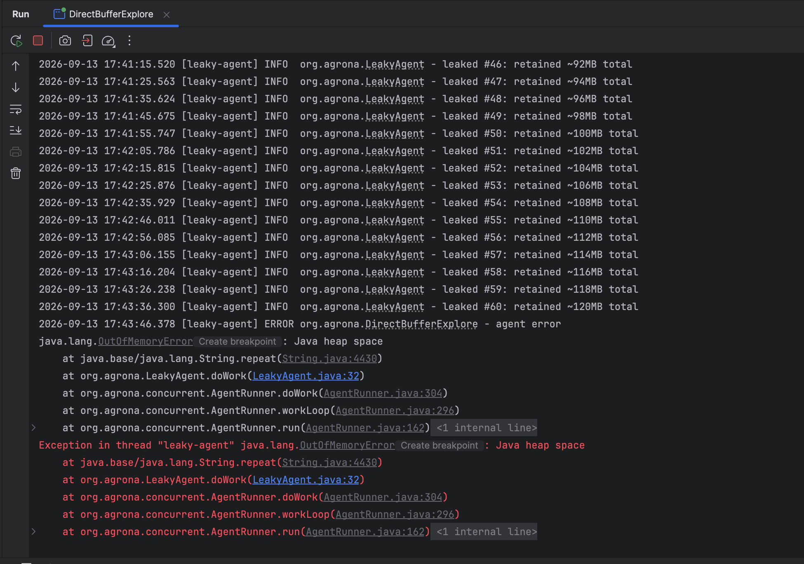
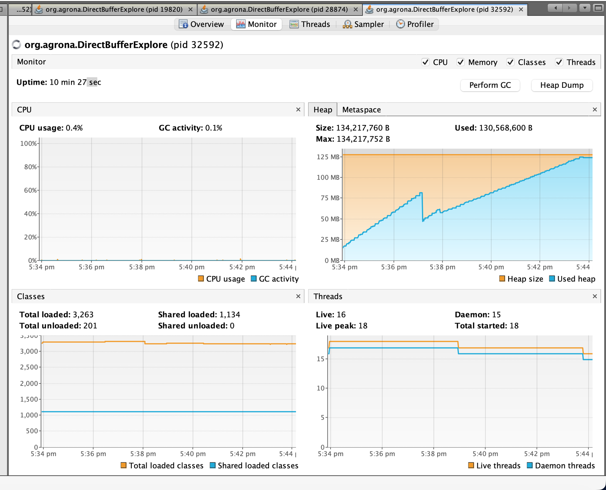

# GC Deep Dive: From a Deliberate Leak to OutOfMemoryError

A hands-on exploration of G1 garbage collection, built by writing a small Agrona `Agent` that
deliberately leaks memory, then watching it die — in VisualVM, in the application log, and in
the JVM's own `-Xlog:gc*` log. This page walks through **everything** needed to read that story,
assuming no prior GC knowledge.

New to GC entirely? Start with [GC Basics, Visually](gc-basics.md) first — it covers generations,
Eden/Survivor, and G1 regions with diagrams, and this page assumes that vocabulary throughout.

Companion reading: [Stack vs Heap](test.md) (what lives where), [Shutdown Mechanisms](shutdown.md)
(how the demo process starts/stops cleanly).

---

## 1. Why garbage collection exists

Every `new String(...)`, every `"x".repeat(...)`, every object literal carves out space on the
heap. Java has no `free()` — nothing ever *explicitly* releases that memory. Instead, the
**Garbage Collector (GC)** runs periodically, walks the graph of objects reachable from your
running threads (local variables, static fields, etc. — the **GC roots**), and reclaims memory
behind everything that *isn't* reachable anymore.

A **memory leak** in Java doesn't mean "forgot to free something" (there's no `free`). It means
**something is still holding a reference to an object you don't actually need anymore**, so the
GC — correctly, by its own rules — can never reclaim it. That's exactly what we built on purpose
below.

## 2. The generational hypothesis

Across nearly every GC-heavy language, one empirical pattern holds: **most objects die young**.
A temporary string built for one calculation, a formatting buffer, a loop-local object — most
garbage is created and discarded within milliseconds. Long-lived objects (caches, config,
connection pools, and — in our demo — a deliberately-retained list) are comparatively rare.

Collectors exploit this by splitting the heap into **generations**:

| Generation | Contains | Collected | Cost |
|---|---|---|---|
| **Young** (Eden + Survivor) | Everything is *born* here | Often | Cheap — mostly garbage, few live objects to copy out |
| **Old** | Objects that survived enough young collections get *promoted* here | Rarely | Expensive — scanning a large, mostly-live set |

## 3. G1 specifically: a heap made of regions

Older collectors (Serial, Parallel) used one contiguous Eden space and one contiguous Old space.
**G1 ("Garbage First")**, the default collector since JDK 9, instead chops the whole heap into
fixed-size chunks called **regions**. Each region is labeled Eden, Survivor, Old, or Humongous —
dynamically, not fixed at JVM startup. G1 always collects the regions with the most garbage in
them first (hence the name), to get the best reclaim-per-millisecond-of-pause.

From a real run's log header:

```
[0.006s][info][gc,init] Heap Region Size: 1M
[0.006s][info][gc,init] Heap Min Capacity: 8M
[0.006s][info][gc,init] Heap Initial Capacity: 128M
[0.006s][info][gc,init] Heap Max Capacity: 128M
```

Region size is chosen automatically from heap size (small heap → small regions, 1MB minimum).
128MB max heap ÷ 1MB regions = **128 regions total** to work with. Remember this number — it's
the ceiling everything below eventually runs into.

## 4. Anatomy of one young collection, line by line

```
[12.987s] GC(0) Pause Young (Normal) (G1 Evacuation Pause)
[12.987s] GC(0) Using 3 workers of 10 for evacuation
[12.989s] GC(0)   Evacuate Collection Set: 1.8ms
[12.989s] GC(0) Eden regions: 23->0(36)
[12.989s] GC(0) Survivor regions: 0->3(3)
[12.989s] GC(0) Old regions: 0->2
[12.989s] GC(0) Pause Young (Normal) (G1 Evacuation Pause) 27M->9M(128M) 2.308ms
```

- **"Pause Young"** — a **stop-the-world** pause. *Every* application thread freezes completely
  for the duration; only GC worker threads run.
- **"Using 3 workers of 10"** — G1 pauses are parallelized across multiple GC threads to keep
  them short.
- **"Evacuate Collection Set: 1.8ms"** — the actual work: find every object in Eden still
  reachable, and **copy** it out into a Survivor region. Anything left behind afterward is, by
  definition, garbage — G1 doesn't delete it object-by-object, it just marks the whole region
  empty and reuses it. This copy-only approach is *why* young collections are cheap: you only
  touch live objects, never the garbage.
- **"Eden regions: 23->0(36)"** — 23 regions were Eden before the pause; 0 after (everything
  evacuated or discarded); `(36)` is the *new target Eden size* G1 picked going forward, adapted
  to hit its pause-time goal.
- **"Survivor regions: 0->3(3)"** — the objects that survived got copied into 3 fresh regions.
- **"Old regions: 0->2"** — a couple of long-lived objects were promoted (survived enough
  previous collections).
- **"27M->9M(128M) 2.308ms"** — the pause summary: 27MB used before, 9MB after (18MB reclaimed),
  out of a 128MB cap, and the *entire* stop-the-world pause took 2.3 milliseconds. That pause
  time is the number that matters for application latency.

## 5. Humongous objects — the key to this whole story

G1's rule: **any single object ≥ 50% of the region size doesn't go through the normal
Eden→Survivor→Old lifecycle at all.** It's allocated directly into one or more dedicated
**Humongous regions**, bypassing young gen completely.

With a 1MB region size, that threshold is **512KB**. Our leaked strings are **2MB** each — 4x
over the threshold — so *every single one* becomes a humongous object: allocated straight into
old-gen-like territory, never copied, never touched by an ordinary young collection.

```
[251.675s] GC(2) Pause Young (Concurrent Start) (G1 Humongous Allocation)
[251.675s] GC(2) Humongous regions: 50->50
```

The pause *reason* literally says `(G1 Humongous Allocation)` — this pause was triggered by code
requesting a 2MB allocation. G1's allocator needs 2 contiguous free 1MB regions for that request,
and does a quick young collection first (freeing up space, re-checking) before granting it. That's
a real, measurable cost of leaking (or even just frequently allocating) large objects: each one
doesn't just consume memory, it actively triggers a GC pause on the way in.

!!! warning "Practical takeaway"
    In real services, avoid allocating objects near or above half your G1 region size in hot
    paths if you can help it (e.g. building one giant `StringBuilder`/`byte[]` per request
    instead of streaming/chunking). Each one is a small, guaranteed GC event, and it can never be
    young-collected once created — only ever compacted by a full/mixed GC.

## 6. Why humongous regions only ever grow (in a leak)

```
GC(2)  Humongous regions: 50->50
GC(4)  Humongous regions: 52->52
GC(6)  Humongous regions: 54->54
...
GC(20) Humongous regions: 68->68
```

The format is `before->after` **for that one pause**. It's flat within a single pause (a young
collection doesn't touch old/humongous regions), but *across* pauses it climbs by exactly 2 every
time — one more 2MB (2-region) string retained between each tick. A young collection can never
free a humongous region that's still reachable — only a full/mixed collection that finds it
**unreachable** could, and ours never becomes unreachable, because our code never stops
referencing it.

## 7. Concurrent Mark Cycle — how G1 deals with old gen without long pauses

```
[261.748s] GC(5) Concurrent Mark Cycle
[261.748s] GC(5)   Concurrent Scan Root Regions        0.635ms
[261.749s] GC(5)   Concurrent Mark From Roots          5.396ms
[261.754s] GC(5) Pause Remark                          8.778ms
[261.766s] GC(5) Pause Cleanup                         0.063ms
[261.766s] GC(5)   Concurrent Rebuild Remembered Sets   2.475ms
```

Old gen is rarely collected, but G1 still needs to eventually know what's garbage in there.
Rather than one long stop-the-world scan of the whole old generation (which would freeze the app
for a long time on a big heap), G1 does most of the work **concurrently** — while application
threads keep running normally:

- **Scan Root Regions / Mark From Roots** — walk the object graph from GC roots to find
  everything reachable, concurrently, no stop-the-world.
- **Pause Remark** — a *short* stop-the-world pause to catch up on anything the app mutated
  mid-mark.
- **Pause Cleanup** — another short pause to finalize which regions are now known-garbage.

These pauses are single-digit milliseconds, versus what a naive full old-gen scan would cost —
that's G1's whole design point: short, predictable pauses even as the heap grows, at the cost of
extra background CPU.

This cycle gets triggered automatically after a humongous allocation pause (see the pattern:
`Pause Young (Concurrent Start)` immediately followed by `Concurrent Mark Cycle`). G1 uses
humongous allocations as one of its triggers to check "is it time to reclaim old-gen garbage." It
never finds much to reclaim here, because the only old-gen-ish garbage in this demo *is* the leak
— always reachable, never collectable.

---

## 8. The demo itself

### The leaking Agent

An Agrona `Agent` whose `doWork()` is polled by an `AgentRunner` on its own thread — if that
sentence is unfamiliar, read [Agrona's Agent Pattern, Explained](agrona-agent-pattern.md) first,
it covers `Agent`/`AgentRunner`/`IdleStrategy` from scratch. Every 10 seconds this one builds a
2MB string and appends it to a list it never clears:

```java
public class LeakyAgent implements Agent {
    private static final Logger LOG = LoggerFactory.getLogger(LeakyAgent.class);
    private static final long INTERVAL_NS = TimeUnit.SECONDS.toNanos(10);
    private static final int CHARS_PER_TICK = 2_000_000; // ~2MB per allocation

    private final List<String> retained = new ArrayList<>();
    private long nextFireNs;
    private long totalBytes;

    @Override
    public void onStart() {
        nextFireNs = System.nanoTime();
    }

    @Override
    public int doWork() {
        final long now = System.nanoTime();
        if (now < nextFireNs) {
            return 0; // idle strategy backs off — no busy-spin
        }

        final String chunk = "x".repeat(CHARS_PER_TICK);
        retained.add(chunk); // deliberately never released
        totalBytes += chunk.length();

        LOG.info("leaked #{}: retained ~{}MB total", retained.size(), totalBytes / 1_000_000);
        nextFireNs = now + INTERVAL_NS;

        return 1;
    }

    @Override
    public String roleName() {
        return "leaky-agent";
    }
}
```

Why `"x".repeat(2_000_000)` is ~2MB and not ~4MB: **Compact Strings** (JEP 254, default since
Java 9). Since `'x'` is Latin-1-representable, the JVM stores the backing array as `byte[]`
(1 byte/char) instead of `char[]` (2 bytes/char UTF-16). A non-Latin-1 character would double the
size for the same character count.

### Wiring it up with a real daemon thread

```java
AgentRunner leakyRunner = new AgentRunner(
    new SleepingIdleStrategy(TimeUnit.MILLISECONDS.toNanos(100)),
    error -> LOG.error("agent error", error),
    null,
    new LeakyAgent());

AgentRunner.startOnThread(leakyRunner, runnable -> {
    Thread thread = new Thread(runnable);
    thread.setDaemon(true);
    return thread;
});
```

!!! note "`AgentRunner.startOnThread(runner)` does NOT make a daemon thread"
    The no-arg overload uses `Thread::new` as its `ThreadFactory` — a thread created that way
    inherits daemon-ness from its *creator* thread. Since `main` is non-daemon, the agent thread
    would be non-daemon too. To actually get a daemon thread, use the
    `startOnThread(runner, ThreadFactory)` overload with a factory that calls
    `setDaemon(true)` explicitly, as above. Confirmed by decompiling `AgentRunner.class` —
    the no-arg overload's bytecode only calls `setName(roleName())` and `start()`, nothing else.
    Full explanation: [Agrona's Agent Pattern §5](agrona-agent-pattern.md#5-the-daemon-thread-pitfall).

!!! tip "Reproducing this exact run"
    All three demo agents live in the same `Main.java` (renamed from `DirectBufferExplore.java`),
    each wired up as its own commented-out `AgentRunner` block. To reproduce this leak run
    specifically, make sure the `LeakyAgent`/`leakyRunner` block is uncommented and any others
    (e.g. `SurvivorDemoAgent`) are commented out — only one agent should be active at a time for a
    clean, unconfounded GC log.

### Logging — timestamps, thread name, everything

Console output uses `slf4j-api` + `logback-classic`, configured via `src/main/resources/logback.xml`:

```xml
<configuration>
    <appender name="STDOUT" class="ch.qos.logback.core.ConsoleAppender">
        <encoder>
            <pattern>%d{yyyy-MM-dd HH:mm:ss.SSS} [%thread] %-5level %logger{36} - %msg%n</pattern>
        </encoder>
    </appender>
    <root level="INFO">
        <appender-ref ref="STDOUT"/>
    </root>
</configuration>
```

Sample output right before the crash:

```
2026-09-13 17:43:36.300 [leaky-agent] INFO  org.agrona.LeakyAgent - leaked #60: retained ~120MB total
2026-09-13 17:43:46.378 [leaky-agent] ERROR org.agrona.DirectBufferExplore - agent error
java.lang.OutOfMemoryError: Java heap space
    at java.base/java.lang.String.repeat(String.java:4430)
    at org.agrona.LeakyAgent.doWork(LeakyAgent.java:32)
    at org.agrona.concurrent.AgentRunner.doWork(AgentRunner.java:304)
    at org.agrona.concurrent.AgentRunner.workLoop(AgentRunner.java:296)
    at org.agrona.concurrent.AgentRunner.run(AgentRunner.java:162)
Exception in thread "leaky-agent" java.lang.OutOfMemoryError: Java heap space
    ...
```



!!! note "Why this doesn't go through our own `errorHandler`"
    `OutOfMemoryError` is an `Error`, not an `Exception`. `Agent.doWork()` is declared
    `throws Exception`, so `AgentRunner`'s internal catch only wraps `Exception` — an `Error`
    escapes straight past it and is handled by the JVM's default uncaught-exception handler
    instead (which is why the log line above says `Exception in thread "leaky-agent"`, printed
    by the JVM itself, not by our `LOG.error(...)` handler — though that ran too, first).

### Enabling the GC log

```
-Xmx128m -Xlog:gc*:file=/path/to/gc.log --add-opens java.base/jdk.internal.misc=ALL-UNNAMED
```

- `-Xmx128m` caps the heap small on purpose, so the leak dies in minutes instead of taking down
  the whole machine over a much longer, less-observable window.
- `-Xlog:gc*:file=...` is the modern (JDK 9+) unified logging flag — logs every GC phase in
  detail to a file, which is the *only* one of the three observation tools (console, VisualVM,
  GC log) that ends up telling the full story (see below).
- `--add-opens java.base/jdk.internal.misc=ALL-UNNAMED` — an unrelated but necessary flag on
  JDK 17+: Agrona's `ShutdownSignalBarrier` reflectively touches `jdk.internal.misc.Signal` to
  hook SIGINT/SIGTERM, which throws `IllegalAccessException` without this flag (a real regression
  introduced between Aeron 1.43.0 and 1.48.0 — the older version didn't need it).

---

## 9. Reading the three observation tools together

Three tools were watched on the same run: **VisualVM's Monitor tab**, the **application console
log**, and the **GC log**. Cross-checking them against each other is itself a performance
engineering skill worth practicing.

### What VisualVM's Monitor tab showed



- **Used heap**: climbed in a staircase pattern (~2MB step every 10s, matching the leak), with
  **one big drop** partway through (~85MB → ~40MB), then resumed climbing after — and, over the
  full 10-minute run shown above, kept climbing all the way to the 134MB ceiling.
- **CPU usage / GC activity**: sat at ~0% for almost the entire run, even in the final minute —
  see below for why that's actively misleading.

### What the console log showed

A clean, human-readable sequence: `leaked #1 ... #60`, each ~10s apart, `retained ~2MB, 4MB, ...
120MB total` — then the `OutOfMemoryError` stack trace, naming the exact line
(`LeakyAgent.java:32`, the `"x".repeat(...)` call) that failed.

### What the GC log showed — the part the other two hid completely

```
grep -c "To-space exhausted" gc.log   →  25
grep -c "Pause Full" gc.log           →  54
```

In the final ~81 seconds before death, G1 attempted **54 full stop-the-world compactions** and
hit **25 "To-space exhausted"** failures — a young collection tried to copy survivors out of Eden
and couldn't even find room for *that*, forcing an emergency full compaction that barely freed
anything (`125M->124M`) before immediately trying again. This is **GC thrashing**: the JVM
burning CPU almost continuously on GC, for almost no gain, because 120 of 128 regions were
permanently locked up as humongous objects that can never be moved or reclaimed.

VisualVM's `CPU usage: 0.4%`, `GC activity: 0.1%` — averaged over a 10-minute, once-per-second
sampled graph — made 54 full GCs crammed into 81 seconds statistically invisible. **If you only
watched VisualVM, you would never know the death spiral happened.** The GC log is the only source
of the three that reveals it — a lesson worth internalizing: dashboards sampled coarsely over
long windows can completely hide short, severe events. Always keep GC logging on for anything
you actually care about diagnosing.

### The one big early drop, explained

```
[206.907s] GC(1) Pause Young (Normal) (G1 Evacuation Pause) 83M->47M(128M) 6.559ms
```

This is an *ordinary* young collection — not triggered by a humongous allocation — that reclaimed
36MB of garbage that had piled up in Eden over the previous ~194 seconds (JIT compiler artifacts,
logging objects, VisualVM's own JMX/RMI polling overhead — its management agent runs *inside your
process*, using your heap, so watching a process changes what you're watching, a real observer
effect). Crucially: this reclaim has **nothing to do with the leak** — the leaked strings are
humongous, never in Eden, never touched by this pause. Proof: the staircase kept **climbing again
right after** the dip; if the leak had stopped, it would have gone flat, not resumed.

### The very end

```
[685.964s][info][gc,heap        ] GC(141) Humongous regions: 120->0
[685.964s][info][gc             ] GC(141) Pause Full (G1 Compaction Pause) 125M->4M(24M) 6.404ms
[685.964s][info][gc,heap,exit   ] Heap
[685.964s][info][gc,heap,exit   ]  garbage-first heap   total 24576K, used 4950K ...
```

The `[gc,heap,exit]` tag only prints when the **whole JVM process terminates** — not just one
thread. An uncaught `OutOfMemoryError` in one agent thread should, by default, kill only that
thread; `main` and everything else should keep running. Seeing the entire heap (including every
humongous region) collapse to near-zero here means the whole process was torn down — either a
manual stop, or something more serious cascading further. This is the one loose thread these logs
alone don't resolve — worth confirming against how the process was actually terminated whenever
you see this in a real investigation.

---

## 10. Glossary

| Term | Meaning |
|---|---|
| **GC root** | A starting point for reachability analysis: local variables on a thread's stack, static fields, JNI references. Anything not reachable from a root, transitively, is garbage. |
| **Region** | G1's fixed-size heap chunk (here, 1MB). Labeled Eden/Survivor/Old/Humongous dynamically. |
| **Eden** | Where new (non-humongous) objects are born. |
| **Survivor** | Where objects that survived at least one young collection are copied to. |
| **Old gen** | Long-lived, promoted objects. Collected rarely, via concurrent marking + mixed/full GCs. |
| **Humongous object/region** | An object ≥ 50% of region size; allocated directly, bypassing Eden; occupies 1+ dedicated regions. |
| **Stop-the-world (STW) pause** | A period where *all* application threads are frozen so GC can safely move/reclaim objects. |
| **Evacuation** | Copying live objects out of a region being collected (Eden→Survivor, or Survivor→Old on promotion). |
| **To-space exhausted** | A young/mixed collection couldn't find enough free space to copy survivors into — an emergency signal that the heap is nearly out of room. |
| **Full GC / compaction** | The last-resort, most expensive collection: scans and compacts the *entire* heap. Frequent full GCs are a red flag. |
| **Concurrent Mark Cycle** | G1's background (mostly non-STW) process for figuring out what's reachable in old gen, so it can be included in future mixed collections. |

## 11. Applying this to real performance engineering work

- **Always run with `-Xlog:gc*:file=...` in anything you're trying to understand**, even in
  dev/staging. It's cheap, and it's the only one of these tools that doesn't average away short,
  severe events.
- **Watch for `(G1 Humongous Allocation)` as a pause *reason*, and a Humongous region count that
  only ever grows.** That combination — regardless of whether it's a "real" leak or just a
  large-object-heavy workload — is a direct line to unnecessary GC pauses and eventual heap
  pressure.
- **"To-space exhausted" + a burst of `Pause Full` entries close together in time is the
  signature of an imminent OOM** — worth alerting on directly in production log-based monitoring,
  well before the actual `OutOfMemoryError` fires.
- **A monitoring dashboard sampled at 1Hz over a long window can hide a real crisis that happens
  in double-digit seconds.** Don't trust "CPU usage: 0.4%, GC activity: 0.1%" as proof nothing bad
  happened — cross-check against the actual GC log when something doesn't add up.
- **A thread dying from an uncaught `Error` is not the same as the JVM exiting.** If you see the
  whole process go down, confirm whether that was requested (a stop button, a signal) or whether
  something cascaded — don't assume.

## Related

- [Agrona's Agent Pattern, Explained](agrona-agent-pattern.md) — the `Agent`/`AgentRunner`/
  `IdleStrategy` plumbing this whole demo is built on.
- [GC Case Study: Healthy Churn](gc-survivor-demo.md) — the counterpart to this page: a second
  agent that does normal small-object churn instead of leaking, showing the Eden→Survivor→Old
  cycle actually happening (which this leak's humongous objects skip entirely).
- [Stack vs Heap](test.md) — the memory model this whole page builds on.
- [Shutdown Mechanisms](shutdown.md) — how `ShutdownSignalBarrier`/`AgentRunner` start and stop
  cleanly, including the daemon-thread pitfall above.
- [Thread Visibility Issues](thread/visibility.md) — another example of "what you'd assume vs.
  what the JVM actually does," verified the same way: read the real behavior, don't guess.
