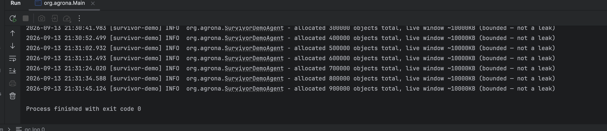
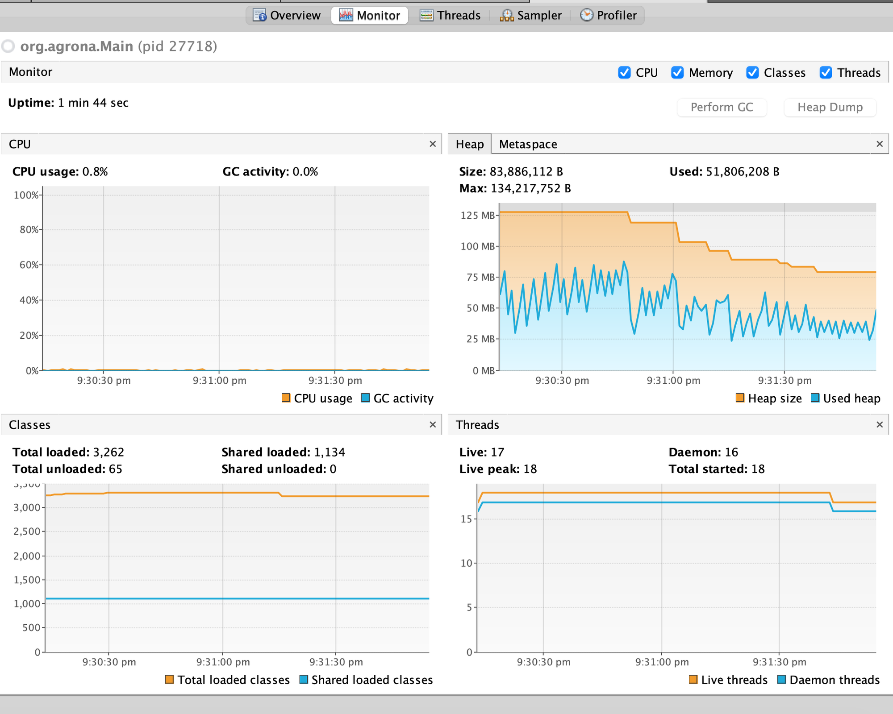

# GC Case Study: Healthy Churn with SurvivorDemoAgent

The [leak-to-OOM case study](gc-leak-oom.md) has one honest gap: `LeakyAgent`'s 2MB strings are
**humongous objects** (see [GC Basics §6](gc-basics.md#6-humongous-objects-the-one-region-type-that-skips-the-whole-lifecycle))
— they're allocated directly into their own dedicated regions and never touch Eden or Survivor at
all. That means the leak demo never actually shows the [Eden → Survivor → Old promotion
cycle](gc-basics.md#4-why-there-are-two-survivor-spaces) from the basics page happening for real.

This page fixes that gap with a second agent, `SurvivorDemoAgent`, that does normal small-object
churn instead of leaking — and, unlike the leak, it runs forever without crashing.

---

## 1. The agent

New to Agrona's `Agent`/`AgentRunner`/`IdleStrategy` pattern? Read
[Agrona's Agent Pattern, Explained](agrona-agent-pattern.md) first — this page assumes it.

```java
public class SurvivorDemoAgent implements Agent {
    private static final Logger LOG = LoggerFactory.getLogger(SurvivorDemoAgent.class);
    private static final long INTERVAL_NS = TimeUnit.MILLISECONDS.toNanos(5);
    private static final int OBJECT_SIZE = 2_048;   // 2KB — far below the 512KB humongous threshold
    private static final int OBJECTS_PER_TICK = 50; // 100KB of new allocation per tick
    private static final int WINDOW_SIZE = 5_000;   // sliding window: ~10MB stays reachable at any time

    private final Deque<byte[]> window = new ArrayDeque<>();
    private long nextFireNs;
    private long totalAllocated;

    @Override
    public void onStart() {
        nextFireNs = System.nanoTime();
    }

    @Override
    public int doWork() {
        final long now = System.nanoTime();
        if (now < nextFireNs) {
            return 0;
        }

        for (int i = 0; i < OBJECTS_PER_TICK; i++) {
            final byte[] chunk = new byte[OBJECT_SIZE];
            ThreadLocalRandom.current().nextBytes(chunk);
            window.addLast(chunk);
            totalAllocated++;

            if (window.size() > WINDOW_SIZE) {
                window.removeFirst(); // oldest ages out here — becomes garbage, not retained forever
            }
        }

        if (totalAllocated % 100_000 < OBJECTS_PER_TICK) {
            LOG.info("allocated {} objects total, live window ~{}KB (bounded — not a leak)",
                totalAllocated, window.size() * OBJECT_SIZE / 1024);
        }

        nextFireNs = now + INTERVAL_NS;
        return 1;
    }

    @Override
    public String roleName() {
        return "survivor-demo";
    }
}
```

The design, and why each choice matters:

- **2KB objects** — small enough that every single one goes through the normal
  Eden→Survivor→Old lifecycle. Nothing here ever becomes humongous.
- **A bounded sliding window** (`ArrayDeque` capped at 5,000 entries) instead of an ever-growing
  list. New objects push in at the tail; once the window is full, the oldest object at the head is
  dropped and becomes garbage. This mimics a real, common pattern — an LRU cache, a recent-events
  buffer, a rolling metrics window — where the *live set size stays roughly constant* even though
  allocation never stops. That single difference from `LeakyAgent` (bounded vs. unbounded
  retention) is what separates "healthy churn" from "leak."
- **Paced at 50 objects / 5ms** — 50 × 2KB = 100KB per tick, 200 ticks/sec, so **~20MB/sec**
  sustained allocation. Fast enough to trigger frequent young collections within seconds, not
  minutes, but throttled (via the same `nextFireNs` self-timing pattern as the other agents) so it
  doesn't peg a CPU core doing nothing but allocate.

Wired into `Main.java` (renamed from `DirectBufferExplore.java`) the same way as the other agents
— its own `AgentRunner`, started on an explicit daemon thread.

!!! tip "Reproducing this exact run"
    `Main.java` keeps every demo agent as its own commented-out `AgentRunner` block. To reproduce
    this run, make sure the `SurvivorDemoAgent`/`survivorRunner` block is uncommented and the
    `LeakyAgent` block is commented out — running both at once works, but makes the GC log harder
    to read cleanly since both workloads mix together.

---

## 2. What the console log shows



`live window ~10000KB` stays exactly constant — 5,000 × 2KB — across 900,000 total allocations.
That's the proof the window is doing its job: memory pressure comes from *allocation rate*, not
from an ever-growing retained set. And notice the last line: **`Process finished with exit code
0`** — no crash. This agent can run indefinitely.

---

## 3. What VisualVM's Monitor tab shows — a completely different shape



Compare this directly to the [leak's heap graph](gc-leak-oom.md#what-visualvms-monitor-tab-showed):

| | `LeakyAgent` | `SurvivorDemoAgent` |
|---|---|---|
| Used heap shape | Staircase, monotonically up | Rapid **sawtooth**, oscillating |
| Heap size (committed) | Stays near max, one late drop | **Steps down** repeatedly as usage stabilizes lower |
| Ends in | `OutOfMemoryError` | Runs forever, clean exit |

The sawtooth here is *visible on the graph itself* — proof that minor GCs are firing frequently
and actually reclaiming real memory each time, unlike the leak where nothing was ever reclaimed.
The `Heap size` line stepping down (128MB → ~58MB) is the same G1 elastic-commit behavior
discussed in the leak case study, but here it's driven by G1 correctly recognizing that a stable,
bounded live set doesn't need as much committed memory over time — not by a single post-GC
resize decision.

---

## 4. What the GC log proves — the full lifecycle, actually happening

This is the part neither screenshot can show: real Survivor-space activity and real Old-gen
promotion *and reclaim*.

### Survivor regions actually flip and vary

```
GC(0)  Survivor regions: 0->3(3)
GC(1)  Survivor regions: 3->4(4)
GC(2)  Survivor regions: 4->9(9)
GC(3)  Survivor regions: 9->8(8)
GC(10) Survivor regions: 8->7(7)
GC(13) Survivor regions: 7->6(6)
GC(15) Survivor regions: 6->5(5)
GC(19) Survivor regions: 4->1(1)
```

Real, continuous change — not the flat, unchanging counts `LeakyAgent`'s log showed (since its
objects never touched Survivor at all).

### Old regions rise AND fall — real promotion, real reclaim

```
GC(21)  Old regions: 32->35
GC(43)  Old regions: 62->69   (climbing)
GC(66)  Old regions: 41->49   (dropped!)
GC(89)  Old regions: 40->48
GC(113) Old regions: 22->28   (dropped again!)
GC(136) Old regions: 33->41
```

`LeakyAgent`'s Humongous region count only ever climbed, forever, because nothing it retained
ever became garbage. Here, Old gen genuinely goes up (objects surviving long enough to be
promoted) *and* down (those same objects eventually aging out of the sliding window, becoming
unreachable, and actually getting reclaimed).

### G1's mixed-collection machinery is running — because there's finally something to reclaim

```
grep -oE "Pause (Young \([A-Za-z ]+\)|Full)" gc.log | sort | uniq -c
  152 Pause Young (Normal)
   38 Pause Young (Concurrent Start)
   38 Pause Young (Prepare Mixed)
   48 Pause Young (Mixed)
```

86 `Prepare Mixed` + `Mixed` pauses combined — these are collections that scan *old gen* regions
looking for reclaimable garbage, and find some. `LeakyAgent`'s log never produced a single one of
these, because there was never anything reclaimable in old gen to justify one. Their presence
here is direct, log-level proof that this workload is healthy: memory that gets promoted
eventually gets reclaimed, exactly as the [generational hypothesis](gc-basics.md#1-the-heap-at-a-glance)
predicts.

Also worth noting: `Humongous regions: 0->0` on every single line of this log — confirming none
of these 2KB objects ever bypassed the normal lifecycle.

---

## 5. The takeaway

Two agents, two completely different signatures, both readable from the same three tools:

| Signal | `LeakyAgent` (leak) | `SurvivorDemoAgent` (healthy) |
|---|---|---|
| Object size | 2MB (humongous) | 2KB (normal) |
| Retention | Unbounded (never released) | Bounded sliding window |
| Survivor activity | None — bypassed entirely | Constant flux |
| Old gen trend | Only ever grows | Rises and falls |
| Mixed GCs | Never happen | Frequent |
| VisualVM heap shape | Staircase climbing to the ceiling | Sawtooth, stable band |
| Outcome | `OutOfMemoryError` | Runs indefinitely |

If you only ever watch a heap graph shaped like a staircase climbing toward the max, that's
already a strong, early, visual signal of a leak — long before the log-level proof
(ever-growing Humongous/Old region counts, or an eventual OOM) confirms it.

---

## 6. Practical rule: where should a `List` field actually live?

Both agents' `List`/`Deque` fields are declared at the **class level** — so what actually decides
whether that shape is `LeakyAgent` or `SurvivorDemoAgent` isn't where the field is declared, it's
whether it has a **bounded lifecycle**.

**Default to a method-level (local) variable whenever you can.** A list created inside a method
is reachable only for that call — once the method returns, it's immediately garbage, dies young
in Eden, and never becomes anyone's problem. This is the right choice for scratch space: build up
results, process them, return.

**Only promote it to a class-level field when the data genuinely must outlive a single method
call** — and the moment you do, you've taken on the responsibility of bounding it:

- **Unbounded `.add()`, nothing ever removed** → `LeakyAgent`'s shape. Grows forever regardless of
  how small each element is, eventually lands in Old gen and never leaves.
- **Bounded** — a fixed-size sliding window, an explicit `clear()`, TTL eviction, a real cache
  with an eviction policy — → `SurvivorDemoAgent`'s shape. Same "class-level field," but the live
  set stays flat no matter how many times it's called.

!!! warning "Instance field vs `static` field — different blast radius"
    An **instance field**'s lifetime is tied to the object holding it — if that object is
    short-lived (e.g. a per-request handler), an unbounded list dies with it anyway, capping the
    damage. A **`static` field** lives as long as the classloader, effectively the whole
    application — an unbounded `static` list is the single most common real-world Java leak
    pattern, because nothing ever makes the containing "object" unreachable to take the list down
    with it.

**Rule of thumb:** local by default; class-level field only with a stated bound; `static` field
only with a bound you're very sure about.

## Related

- [Agrona's Agent Pattern, Explained](agrona-agent-pattern.md) — the `Agent`/`AgentRunner`/
  `IdleStrategy` plumbing this whole demo is built on.
- [GC Deep Dive: Leak to OOM](gc-leak-oom.md) — the failure case this page contrasts against.
- [GC Basics, Visually](gc-basics.md) — the Eden/Survivor/Old vocabulary this page puts into
  practice with a real log.
