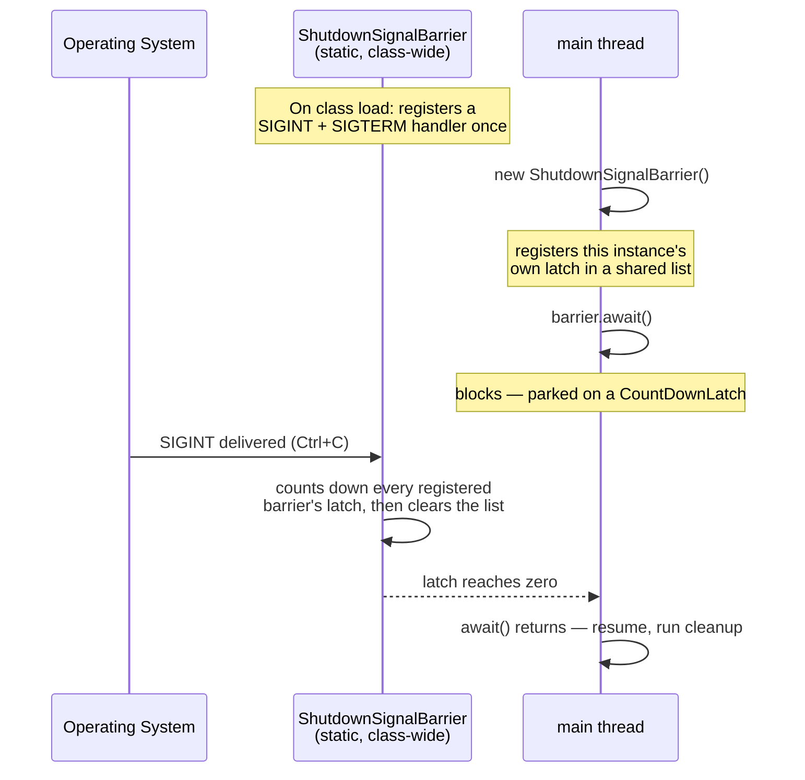

# Graceful Shutdown in Java using ShutdownSignalBarrier

`ShutdownSignalBarrier` blocks a thread (usually `main`) until the process receives SIGINT
(Ctrl+C) or SIGTERM, so `main` doesn't just fall off the end of the method and exit — instead it
waits, giving you a clean, deliberate point to run teardown code before the JVM exits. Common in
Aeron applications, long-running agents, and any daemon-style service.

## The whole pattern

```java
import org.agrona.concurrent.ShutdownSignalBarrier;

ShutdownSignalBarrier barrier = new ShutdownSignalBarrier();

// ... start your agents/threads/servers here ...

barrier.await();      // blocks until Ctrl+C / SIGTERM
// ... run cleanup here ...
```

That's it — **no manual signal registration needed.** `ShutdownSignalBarrier`'s own static
initializer already registers SIGINT and SIGTERM handlers for you, for the whole class, once,
the first time it's loaded. You never need to call `SigInt.register(...)` yourself just to make
this work.



!!! warning "The signal handler is global, not per-instance"
    If you create more than one `ShutdownSignalBarrier` in the same process, **one SIGINT
    releases all of them** — the handler counts down every registered barrier's latch and clears
    the whole shared list in one shot. There's no way to signal just one barrier from an OS
    signal; that's a property of the JVM-wide signal, not of any individual instance.

!!! danger "JDK 17+ gotcha: needs `--add-opens`"
    On JDK 17+, `aeron-all` 1.48.0 (and likely later) needs this JVM flag or the class fails to
    load at all:
    ```
    --add-opens java.base/jdk.internal.misc=ALL-UNNAMED
    ```
    Without it, the very first use of `ShutdownSignalBarrier` throws:
    ```
    java.lang.ExceptionInInitializerError
    Caused by: java.lang.IllegalAccessException: class org.agrona.concurrent.SigInt cannot
    access class jdk.internal.misc.Signal ...
    ```
    This is a real regression between versions — confirmed directly: `aeron-all` 1.43.0 does
    **not** need this flag; 1.48.0 does, because its `SigInt` reflectively touches
    `jdk.internal.misc.Signal` to hook the signal, which the module system blocks by default.
    If you bump your `aeron-all`/Aeron version and this starts throwing, this flag is why.

## Reacting to the signal yourself

If you need to *do something* the instant the signal arrives — not just unblock `main` — pass a
callback to `SigInt.register(...)` in addition to the barrier, or use the constructor overload
some Agrona versions provide for exactly this. Either way, keep the callback itself trivial
(log a line, set a flag) — it runs on whatever thread the OS delivers the signal to, not your
main thread.

??? info "Older vs newer `ShutdownSignalBarrier` internals — what we verified by decompiling both"
    There are actually two different implementations floating around depending on which artifact
    you depend on:

    - **Bundled inside `aeron-all`** (both 1.43.0 and 1.48.0, verified identical by decompiling
      both): a simple design — one static `ArrayList<CountDownLatch>` shared by every instance,
      guarded by a plain `synchronized` block. `signal()` removes and counts down just its own
      latch; the static SIGINT/SIGTERM handler calls a private `signalAndClearAll()` that counts
      down and clears the *entire* list. This is the version the sequence diagram above describes,
      and the one this project actually uses (transitively, via `aeron-all`).
    - **The standalone `org.agrona:agrona` artifact** (e.g. 2.x): a newer, more careful design —
      a `CopyOnWriteArrayList<ShutdownSignalBarrier>`, an `AtomicBoolean` compare-and-swap guard
      so `signal()` only fires once per instance, an optional `SignalHandler` callback, and
      `AutoCloseable` support for try-with-resources. If you depend on standalone `agrona`
      instead of `aeron-all`, you get this version instead — same *purpose*, different
      internals.

    If you're not sure which one you have: check whether `ShutdownSignalBarrier implements
    AutoCloseable` in your IDE's decompiled view. If yes, you have the newer standalone version.

## Related

- [Agrona's Agent Pattern, Explained](agrona-agent-pattern.md) — `AgentRunner.close()` is the
  usual thing you call right after `barrier.await()` returns.
- [GC Deep Dive: Leak to OOM](gc-leak-oom.md) — a full worked example using this exact pattern.
