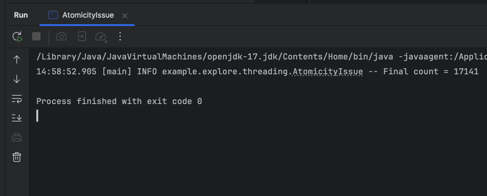
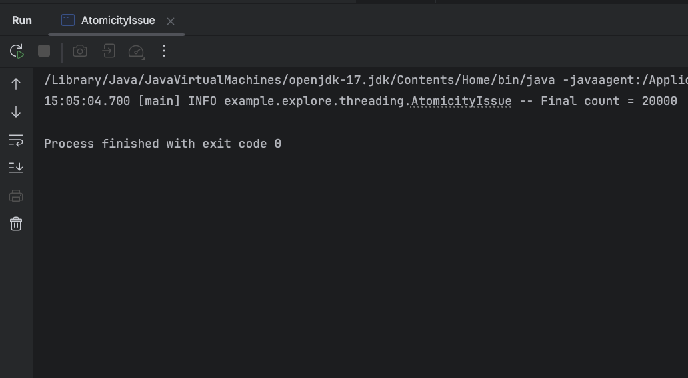

=== "Problem Example (Without volatile)"
    ```java
    @Slf4j
    public class AtomicityIssue {
        static volatile int count = 0;

        public static void main(String[] args) throws InterruptedException {
            Runnable task = () -> {
                for (int i = 0; i < 10_000; i++) {
                    count++; // ❌ not atomic
                }
            };

            Thread t1 = new Thread(task, "T1");
            Thread t2 = new Thread(task, "T2");

            t1.start();
            t2.start();
            t1.join();
            t2.join();

            log.info("Final count = {}", count);
        }
    }

    ```

    
    Because count++ is three operations under the hood:

    - Read count
    - Add 1
    - Write result back

    If two threads do it at the same time, they can both read the same value and overwrite each other → lost updates.

=== "with AtomicInteger"
    ```java hl_lines="3"
    @Slf4j
    public class AtomicityIssue {
        static AtomicInteger count = new AtomicInteger(0);

        public static void main(String[] args) throws InterruptedException {
            Runnable task = () -> {
                for (int i = 0; i < 10_000; i++) {
                    count.incrementAndGet(); // ✅ atomic
                }
            };

            Thread t1 = new Thread(task, "T1");
            Thread t2 = new Thread(task, "T2");

            t1.start();
            t2.start();
            t1.join();
            t2.join();

            log.info("Final count = {}", count.get());
        }
    }


    ```

    
    Always prints Final count = 20000
    because AtomicInteger.incrementAndGet() is thread-safe.


