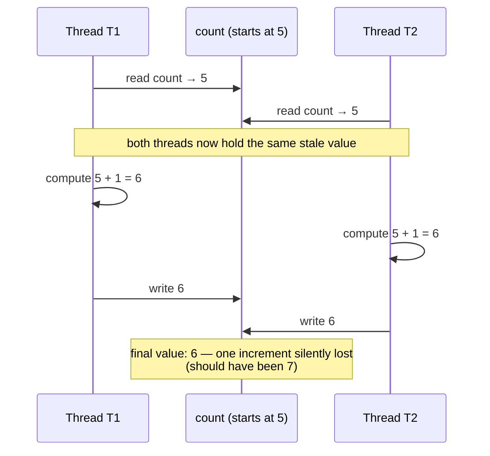
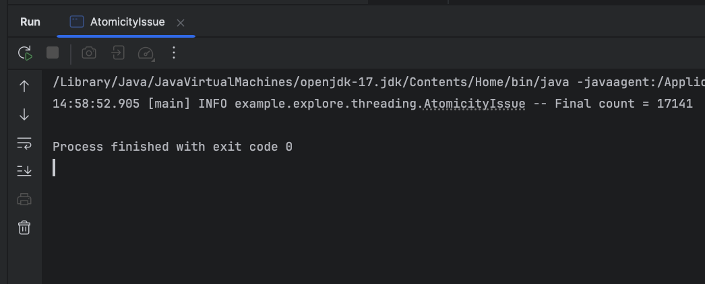
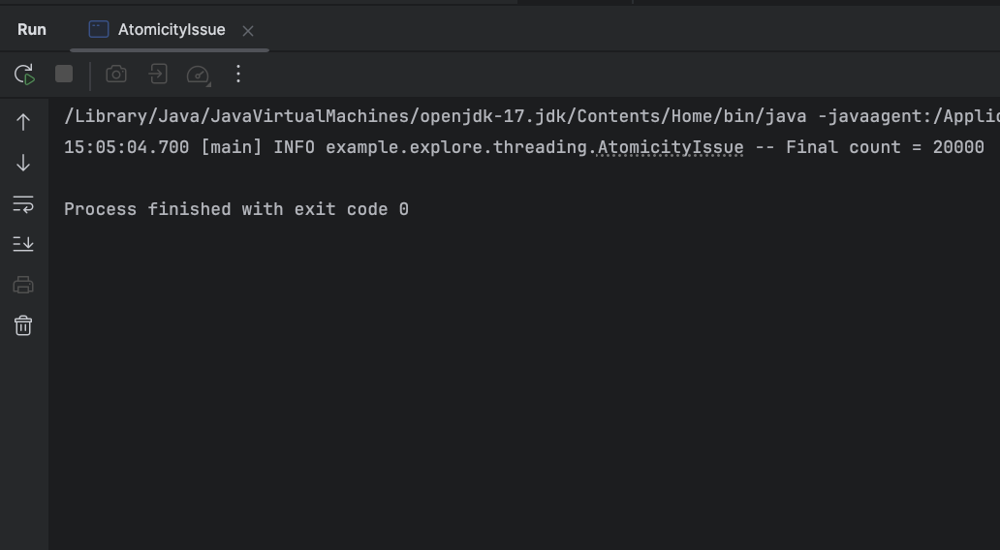

# Atomicity Issues

**Atomicity** means a compound operation happens as one indivisible step — no other thread can
observe it half-done. `count++` looks like one operation in source code, but it's really three:
read, add, write. Two threads can interleave those three steps and silently lose an update, even
if `count` is `volatile` — visibility guarantees the *value* is up to date at the moment of each
read, it says nothing about what happens *between* the read and the write.


```mermaid
sequenceDiagram
    participant T1 as Thread T1
    participant Mem as count (starts at 5)
    participant T2 as Thread T2

    T1->>Mem: read count → 5
    T2->>Mem: read count → 5
    Note over T1,T2: both threads now hold the same stale value
    T1->>T1: compute 5 + 1 = 6
    T2->>T2: compute 5 + 1 = 6
    T1->>Mem: write 6
    T2->>Mem: write 6
    Note over Mem: final value: 6 — one increment silently lost<br/>(should have been 7)
```

Neither thread did anything wrong in isolation — each one correctly read, incremented, and wrote
back. The bug only exists in the *interleaving*, which is exactly why these bugs are
non-deterministic: run it a thousand times and you'll see the right answer most of the time, then
occasionally lose a handful of updates under real contention.

??? info "Why AtomicInteger fixes this without a lock"
    `AtomicInteger.incrementAndGet()` doesn't avoid the read-modify-write shape — it makes the
    whole thing a single **compare-and-swap (CAS)** CPU instruction: "set this memory location to
    `expected + 1`, but only if it still equals `expected`; tell me if it didn't." If another
    thread won the race and changed the value first, the CAS fails and the JVM just retries the
    whole read-compute-CAS cycle in a loop until it succeeds. No thread ever blocks waiting for a
    lock — the "loop and retry" is the entire cost, which is why atomics are usually faster than
    `synchronized` under light-to-moderate contention.

## See it in code

=== "Problem Example (Without AtomicInteger)"
    ```java
    @Slf4j
    public class AtomicityIssue {
        static volatile int count = 0;

        public static void main(String[] args) throws InterruptedException {
            Runnable task = () -> {
                for (int i = 0; i < 10_000; i++) {
                    count++; // ❌ not atomic
                }
            };

            Thread t1 = new Thread(task, "T1");
            Thread t2 = new Thread(task, "T2");

            t1.start();
            t2.start();
            t1.join();
            t2.join();

            log.info("Final count = {}", count);
        }
    }
    ```

    

    Because `count++` is three operations under the hood:

    - Read `count`
    - Add 1
    - Write result back

    If two threads do it at the same time, they can both read the same value and overwrite each
    other → lost updates. Note that `count` is already `volatile` here — visibility isn't the
    problem, atomicity is.

=== "with AtomicInteger"
    ```java hl_lines="3"
    @Slf4j
    public class AtomicityIssue {
        static AtomicInteger count = new AtomicInteger(0);

        public static void main(String[] args) throws InterruptedException {
            Runnable task = () -> {
                for (int i = 0; i < 10_000; i++) {
                    count.incrementAndGet(); // ✅ atomic
                }
            };

            Thread t1 = new Thread(task, "T1");
            Thread t2 = new Thread(task, "T2");

            t1.start();
            t2.start();
            t1.join();
            t2.join();

            log.info("Final count = {}", count.get());
        }
    }
    ```

    

    Always prints `Final count = 20000` because `AtomicInteger.incrementAndGet()` is thread-safe.

## Related

- [Visibility Issues](visibility.md) — a necessary but not sufficient condition for correctness.
- [Ordering Issues](ordering.md) — the other half of the Java Memory Model story.
- [`volatile` Deep Dive](../volatile.md) — visibility and atomicity side by side.
