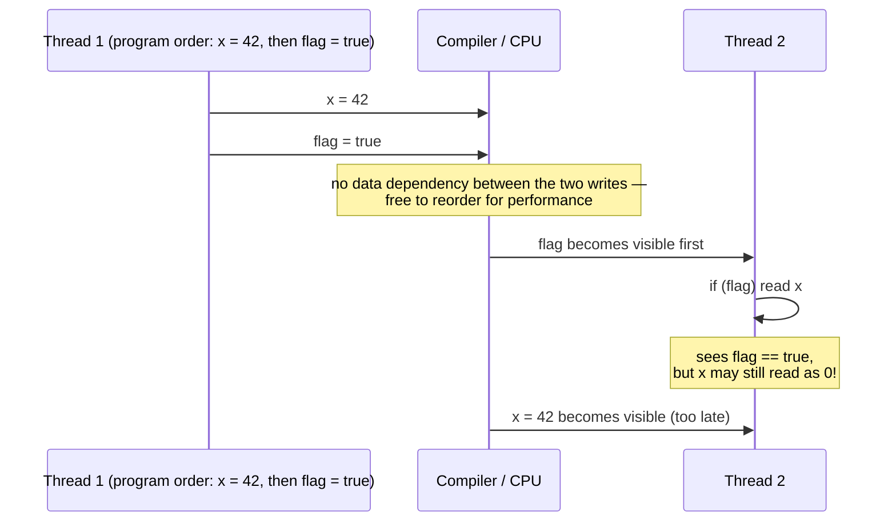

# Ordering Issues

**Ordering** is the third pillar alongside [visibility](visibility.md) and
[atomicity](atomicity.md): even if every write eventually becomes visible, and even if each
individual operation is atomic, the compiler and CPU are still free to **reorder independent
instructions** for performance — as long as the result looks unchanged from that one thread's own
point of view. That freedom is exactly what breaks a second thread watching from the outside.



Thread 1 never observes anything wrong — from its own perspective, `x` is always 42 by the time
`flag` is checked, because a thread always sees *its own* writes in program order. The reordering
is only detectable from Thread 2's point of view, which is exactly why these bugs are invisible
in single-threaded testing and only surface under real concurrency.

The ordering problem in multithreaded programming can be caused by:

=== "Due to single thread"
    Modern compilers and CPUs may reorder instructions for performance as long as the result is the same from the perspective of that single thread.

    🔸 But this can break correctness in multithreaded scenarios.

    ```java
    int x = 0;
    boolean flag = false;

    // Thread 1
    x = 42;           // Step 1
    flag = true;      // Step 2 (might be reordered before Step 1)

    // Thread 2
    if (flag) {
        System.out.println(x); // May print 0!
    }
    ```

    Because the compiler/CPU might reorder setting `flag = true` before `x = 42`, `Thread 2` might see `flag == true` but read an old value of `x`.

=== "Due to different threads"
    Even if the instructions are ordered correctly in each thread, if there's no proper synchronization (e.g., volatile, locks, atomic ops), Thread 2 may see stale or reordered results due to:

    - CPU caches
    - Memory model differences
    - Write buffers not flushed

## Java Memory Model (JMM)

The Java Memory Model explicitly allows such reordering unless:

- use `volatile`
- synchronize (`synchronized`, `Lock`)
- use atomic classes (`AtomicInteger`, etc.)

These establish **happens-before** relationships that:

- ✅ Prevent reordering
- ✅ Guarantee visibility

??? info "What \"happens-before\" precisely means"
    It's not "happened earlier in wall-clock time" — it's a formal guarantee the JMM makes:
    if action A *happens-before* action B, then A's effects (every write it made) are
    **guaranteed visible** to B, and the JVM/CPU are **forbidden** from reordering B before A.
    Making `flag` volatile establishes a happens-before edge specifically between the write
    `flag = true` and any subsequent read of `flag` that observes `true` — which transitively
    drags `x = 42` along with it, since it happened-before the volatile write in program order.
    That one edge is what fixes the exact bug diagrammed above.

## Related

- [Visibility Issues](visibility.md) — the first pillar.
- [Atomicity Issues](atomicity.md) — the second pillar.
- [`volatile` Deep Dive](../volatile.md) — visibility and atomicity side by side.
