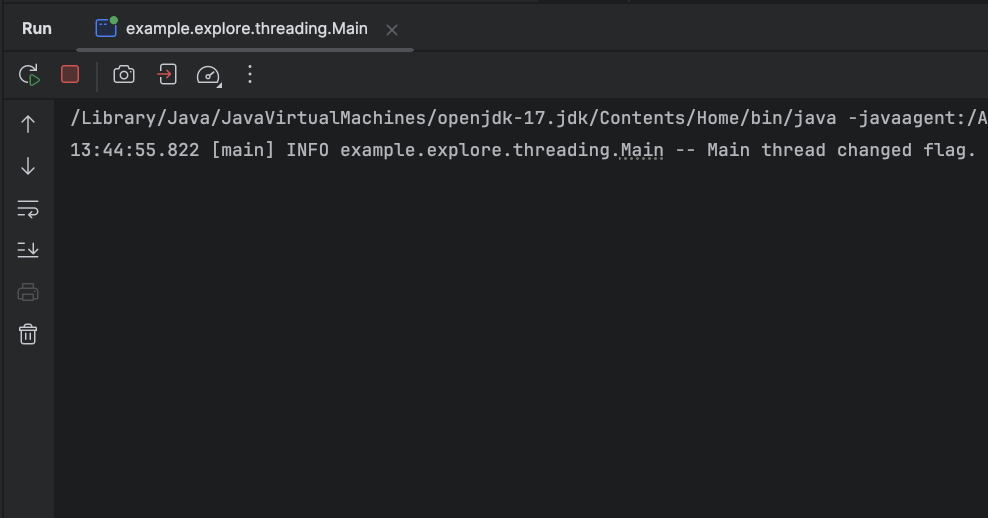
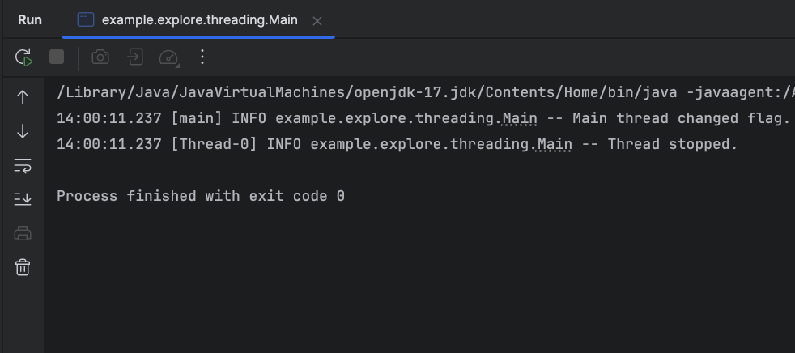

=== "Problem Example (Without volatile)"
    ```java
        @Slf4j
        public class Main {
            static boolean running = true;

            public static void main(String[] args) throws InterruptedException {
                Thread t = new Thread(() -> {
                    while (running) {
                        // do nothing
                    }
                    log.info("Thread stopped.");
                });

                t.start();
                Thread.sleep(1000);
                running = false;
                log.info("Main thread changed flag.");
            }
        }

    ```

    
    Expected Problem:
    `t` may never stop, because it doesn't see running = false.


=== "with volatile"
    ```java hl_lines="3"
    @Slf4j
    public class Main {
        static volatile boolean running = true;

        public static void main(String[] args) throws InterruptedException {
            Thread t = new Thread(() -> {
                while (running) {
                    // do nothing
                }
                log.info("Thread stopped.");
            });

            t.start();
            Thread.sleep(1000);
            running = false;
            log.info("Main thread changed flag.");
        }
    }

    ```

    
    Now it stops correctly — the change to running is visible to the thread `t`.


