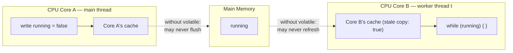
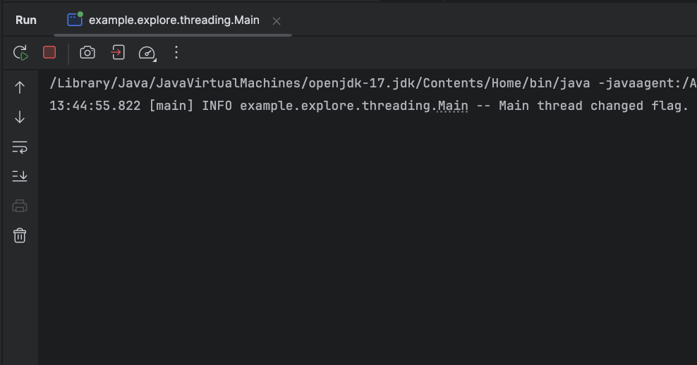
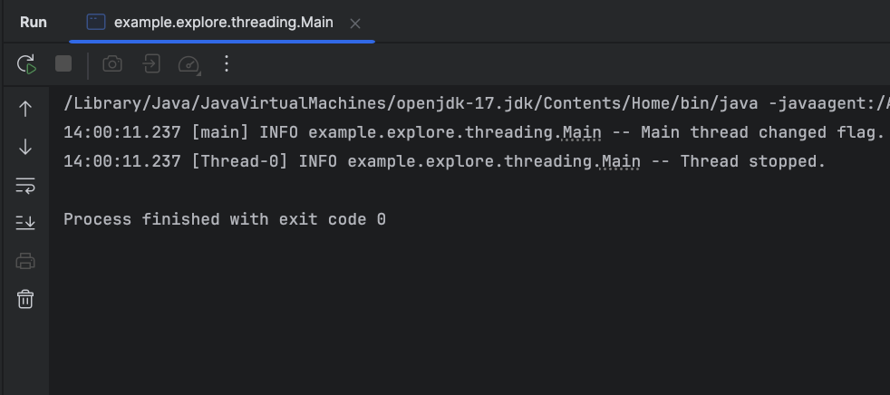

# Visibility Issues

**Visibility** is about whether one thread's write to a variable is guaranteed to be seen by
another thread at all — independent of *when*. Each CPU core can keep its own cached copy of a
variable; without a memory barrier forcing a round trip through main memory, one core's write can
sit in its own cache indefinitely, invisible to a different core reading the same variable.


```mermaid
flowchart LR
    subgraph CoreA["CPU Core A — main thread"]
        WA["write running = false"]
        CacheA["Core A's cache"]
        WA --> CacheA
    end
    subgraph Mem["Main Memory"]
        M["running"]
    end
    subgraph CoreB["CPU Core B — worker thread t"]
        CacheB["Core B's cache (stale copy: true)"]
        RB["while (running) { }"]
        CacheB --> RB
    end

    CacheA -.->|"without volatile:\nmay never flush"| Mem
    Mem -.->|"without volatile:\nmay never refresh"| CacheB
```

Without `volatile`, both dotted arrows are only *maybe* — the JVM/JIT and CPU are free to keep
`running` in Core A's cache and never propagate it, and free to keep Core B reading its own
already-cached copy forever. `t` can spin on `while (running)` indefinitely even though `main`
already flipped the flag.

??? info "What `volatile` actually changes under the hood"
    `volatile` doesn't disable caching in some magic way — it inserts **memory barriers** around
    every read and write of that field: a write gets a *store barrier* (flush this write out,
    don't let it get reordered past this point), and a read gets a *load barrier* (don't read
    from a stale cached copy, don't let a later read get reordered before this point). That's the
    mechanism that turns both dotted arrows above into guarantees.

## See it in code

=== "Problem Example (Without volatile)"
    ```java
    @Slf4j
    public class Main {
        static boolean running = true;

        public static void main(String[] args) throws InterruptedException {
            Thread t = new Thread(() -> {
                while (running) {
                    // do nothing
                }
                log.info("Thread stopped.");
            });

            t.start();
            Thread.sleep(1000);
            running = false;
            log.info("Main thread changed flag.");
        }
    }
    ```

    

    Expected problem: `t` may never stop, because it doesn't see `running = false`.

=== "with volatile"
    ```java hl_lines="3"
    @Slf4j
    public class Main {
        static volatile boolean running = true;

        public static void main(String[] args) throws InterruptedException {
            Thread t = new Thread(() -> {
                while (running) {
                    // do nothing
                }
                log.info("Thread stopped.");
            });

            t.start();
            Thread.sleep(1000);
            running = false;
            log.info("Main thread changed flag.");
        }
    }
    ```

    

    Now it stops correctly — the change to `running` is visible to thread `t`.

## Related

- [Atomicity Issues](atomicity.md) — visibility alone doesn't make compound operations safe.
- [Ordering Issues](ordering.md) — the other half of the Java Memory Model story.
- [`volatile` Deep Dive](../volatile.md) — visibility and atomicity side by side.
