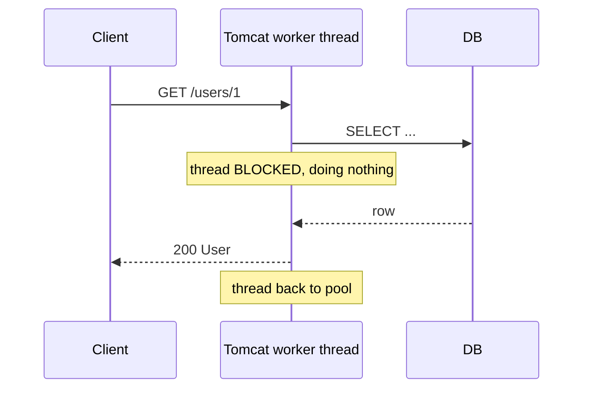
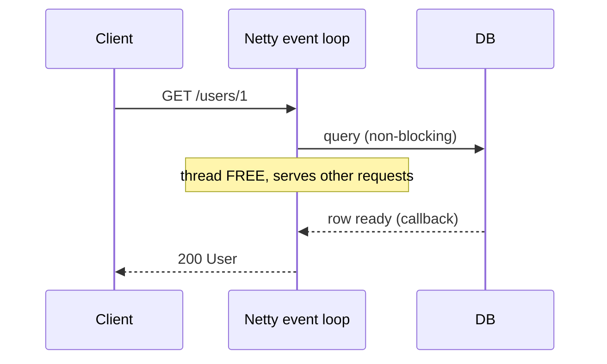
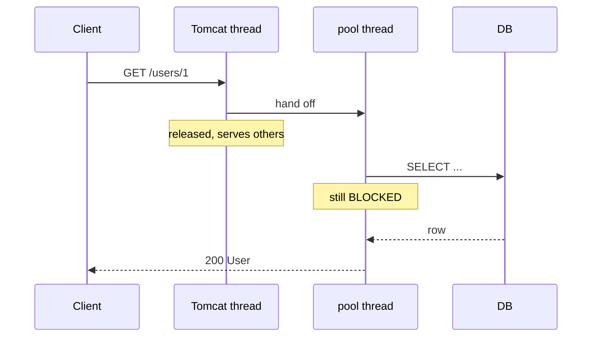
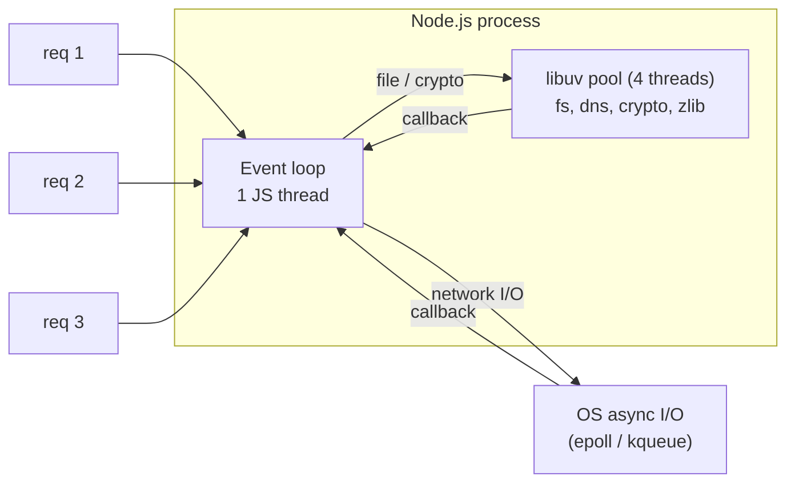

# Spring MVC vs Spring WebFlux

Two web stacks in Spring. Same annotations, very different threading underneath.

- **Spring MVC**: blocking, one thread per request (Servlet API, Tomcat).
- **Spring WebFlux**: non-blocking, a few event-loop threads serve all requests (Reactive Streams, Netty).

---

## Threading model

### Spring MVC: thread per request

Each request takes a worker thread from Tomcat's pool (default max 200). The thread **waits** while the DB or a downstream HTTP call runs.



201st concurrent slow request → waits in queue. Scale = more threads = more memory (~1MB stack each).

### Spring WebFlux: event loop

Netty runs a small number of event-loop threads (≈ CPU cores, min 4). A thread **never waits**. It registers a callback and moves on to the next request.



Thousands of concurrent slow requests on ~8 threads. The catch: **everything** in the chain must be non-blocking.

---

## Side by side

| | Spring MVC | Spring WebFlux |
|---|---|---|
| Starter | `spring-boot-starter-web` | `spring-boot-starter-webflux` |
| API | Servlet | Reactive Streams (Project Reactor) |
| Default server | Tomcat | Netty |
| Threads | pool, 1 per request (max 200) | event loop, ≈ CPU cores |
| Return type | `User`, `List<User>` | `Mono<User>`, `Flux<User>` |
| DB access | JDBC, JPA/Hibernate | R2DBC, reactive Mongo/Redis |
| HTTP client | `RestClient` / `RestTemplate` | `WebClient` |
| Test | `MockMvc` | `WebTestClient` |
| Stack traces | readable | fragmented across operators |
| Learning curve | low | high |

`Mono<T>` = 0 or 1 value later. `Flux<T>` = 0..N values later (a stream).

---

## Async ≠ non-blocking

The real difference is **not** sync vs async. Spring MVC can be async too (Servlet 3.0+):

```java
@GetMapping("/{id}")
CompletableFuture<User> get(@PathVariable long id) {
    return CompletableFuture.supplyAsync(() -> repo.findById(id).orElseThrow(), pool);
}
```

MVC also accepts `DeferredResult`, `Callable`, `WebAsyncTask`, even `Mono`/`Flux` as return types. The Tomcat thread is released early, but `repo.findById` is still JDBC, so **a thread in `pool` sits blocked** waiting for the DB. Async only moves the waiting to another thread.



| | MVC (even async) | WebFlux |
|---|---|---|
| Is some thread waiting on I/O? | yes, somewhere | no, if whole chain is non-blocking |
| I/O APIs | blocking (JDBC, Servlet `InputStream`) | non-blocking (R2DBC, `WebClient`, Netty) |
| Threads needed | grows with concurrent waits | fixed, ≈ CPU cores |
| Backpressure | no | yes, built into Reactive Streams |

**Async** = "*I* don't wait". **Non-blocking** = "*nobody* waits". Only WebFlux is designed for the second.

### Async request timeout (MVC)

Global default, applies to every async endpoint:

```yaml
spring:
  mvc:
    async:
      request-timeout: 30s
```

Per endpoint: set it on the return value, which overrides the global value for that request:

=== "DeferredResult"

    ```java
    @GetMapping("/{id}")
    DeferredResult<User> get(@PathVariable long id) {
        DeferredResult<User> result = new DeferredResult<>(5_000L);   // 5s, this endpoint only
        result.onTimeout(() -> result.setErrorResult(
                ResponseEntity.status(HttpStatus.GATEWAY_TIMEOUT).build()));
        pool.submit(() -> result.setResult(repo.findById(id).orElseThrow()));
        return result;
    }
    ```

=== "WebAsyncTask (Callable)"

    ```java
    @GetMapping("/{id}")
    WebAsyncTask<User> get(@PathVariable long id) {
        WebAsyncTask<User> task = new WebAsyncTask<>(5_000L,
                () -> repo.findById(id).orElseThrow());
        task.onTimeout(() -> { throw new ResponseStatusException(HttpStatus.GATEWAY_TIMEOUT); });
        return task;
    }
    ```

=== "Inject request (any return type)"

    ```java
    @GetMapping("/{id}")
    CompletableFuture<User> get(@PathVariable long id, HttpServletRequest request) {
        WebAsyncUtils.getAsyncManager(request)
                .getAsyncWebRequest()
                .setTimeout(5_000L);                  // this request only
        return CompletableFuture.supplyAsync(() -> repo.findById(id).orElseThrow(), pool);
    }
    ```

    Works for `CompletableFuture`, `Callable`, `Mono`, i.e. return types with no timeout of their own.
    Needs Spring Framework 6.1.5+ (`getAsyncWebRequest()` is missing in 6.1.1 and 5.x).

**How it works:** before calling your method, `RequestMappingHandlerAdapter` sets the global timeout on the request's `AsyncWebRequest`. After the method returns, Spring overwrites it only if the return value carries its own timeout (`DeferredResult(timeout)`, `WebAsyncTask(timeout)`). So a timeout set via the injected request survives for `CompletableFuture` / `Callable` / `Mono`, but a `DeferredResult`/`WebAsyncTask` timeout wins over it.

With no `onTimeout` handler, a timeout throws `AsyncRequestTimeoutException` → **503**.

Raw servlet `request.startAsync().setTimeout(...)` also works but bypasses Spring's async handling. Prefer the return types above.

!!! warning "Timeout ≠ cancel"
    When the MVC timeout fires, the **client** gets its response, but the pool thread keeps running until the JDBC call finishes. Many timeouts can still fill up the pool.

    WebFlux `Mono.timeout(Duration.ofSeconds(5))` **cancels the subscription**. With a non-blocking driver the query/HTTP call is actually cancelled and nothing is left waiting.

---

## Same endpoint in both

=== "Spring MVC"

    ```java
    @RestController
    @RequestMapping("/users")
    class UserController {
        private final UserRepository repo;          // JpaRepository
        private final RestClient client;

        @GetMapping("/{id}")
        User get(@PathVariable long id) {
            User u = repo.findById(id).orElseThrow(); // thread waits here
            u.setScore(client.get().uri("/score/{id}", id)
                    .retrieve().body(Integer.class)); // and here
            return u;
        }
    }
    ```

=== "Spring WebFlux"

    ```java
    @RestController
    @RequestMapping("/users")
    class UserController {
        private final UserRepository repo;          // R2dbcRepository
        private final WebClient client;

        @GetMapping("/{id}")
        Mono<User> get(@PathVariable long id) {
            return repo.findById(id)                  // nothing runs yet
                .flatMap(u -> client.get().uri("/score/{id}", id)
                    .retrieve().bodyToMono(Integer.class)
                    .map(score -> { u.setScore(score); return u; }));
        }                                             // runs when Netty subscribes
    }
    ```

=== "WebFlux functional style"

    ```java
    @Bean
    RouterFunction<ServerResponse> routes(UserHandler h) {
        return route(GET("/users/{id}"), h::get);
    }
    ```

Key difference: the WebFlux method returns **a plan**, not a result. Nothing executes until the framework subscribes.

---

## Streaming: where WebFlux shines

```java
@GetMapping(value = "/prices", produces = MediaType.TEXT_EVENT_STREAM_VALUE)
Flux<Price> prices() {
    return priceService.stream();   // pushes each price to client as it arrives (SSE)
}
```

Backpressure: a slow client makes `Flux` slow down the producer, instead of buffering until OOM.

---

## The trap: blocking inside WebFlux

```java
@GetMapping("/{id}")
Mono<User> get(@PathVariable long id) {
    User u = jdbcRepo.findById(id);   // BLOCKS the event loop
    return Mono.just(u);
}
```

With 8 event-loop threads, 8 slow JDBC calls = **whole server frozen**. Worse than MVC.

Fix if you must call blocking code:

```java
Mono.fromCallable(() -> jdbcRepo.findById(id))
    .subscribeOn(Schedulers.boundedElastic());   // run on a separate blocking-friendly pool
```

Find hidden blocking calls in tests with [BlockHound](https://github.com/reactor/BlockHound).

---

## Comparison: Node.js

Node.js uses the same event-loop idea as WebFlux, and is the easiest way to picture it.



Same endpoint in Node:

```js
app.get('/users/:id', async (req, res) => {
  const user = await db.findUser(req.params.id);   // loop is free while waiting
  user.score = await fetch(`/score/${user.id}`).then(r => r.json());
  res.json(user);
});
```

`async/await` reads like MVC but runs like WebFlux: each `await` frees the thread.

Same trap too:

```js
app.get('/hash', (req, res) => {
  const h = crypto.pbkdf2Sync(pw, salt, 1e6, 64, 'sha512');  // blocks the ONE thread
  res.send(h);                                               // every other request waits
});
```

| | Node.js | Spring WebFlux |
|---|---|---|
| Event loops | **1** per process | ≈ 1 per CPU core |
| Use all cores | need `cluster` / multiple processes | yes, out of the box |
| Async primitive | `Promise` (1 value) | `Mono` (0..1), `Flux` (0..N) |
| Backpressure | streams only (`pipe`) | built into every `Flux` |
| "Reactive" lib | RxJS (optional) | Reactor (core) |
| Blocking escape hatch | `worker_threads` | `Schedulers.boundedElastic()` |

So Node.js is **event-driven, non-blocking**, but not reactive in the Reactive Streams sense. `async/await` has no operators and no backpressure. WebFlux is the event loop plus a full stream library.

---

## When to use which

**Pick Spring MVC when:**

- Using JPA/Hibernate/JDBC (blocking drivers)
- Typical CRUD service, moderate concurrency
- Team not already fluent in Reactor
- Debuggability matters more than max concurrency

**Pick Spring WebFlux when:**

- Many concurrent **I/O-bound** calls (gateway, aggregator, fan-out to many downstreams)
- Streaming to clients: SSE, WebSocket, live prices
- The whole chain is non-blocking (R2DBC, reactive Mongo/Redis, `WebClient`)

**Neither helps CPU-bound work.** Heavy computation blocks any thread, whatever the model.

---

## Gotchas

- **Both starters on the classpath → MVC wins.** Spring Boot picks Servlet. Force it with `spring.main.web-application-type=reactive`.
- **`WebClient` works in MVC too.** A common mix: MVC app + `WebClient` for parallel downstream calls, then `.block()` at the edge.
- **`ThreadLocal` does not work in WebFlux** (request hops threads). Use Reactor `Context`. This affects MDC logging and security context.
- **`.block()` inside a WebFlux handler** throws `IllegalStateException` on Netty threads. That's intentional.

---

## Related

- [Polling vs Push](../system_design/polling-and-push.md): SSE/WebSocket patterns that WebFlux streams serve
- [Maven](maven.md) · [Multi-module Maven](mmm.md)
