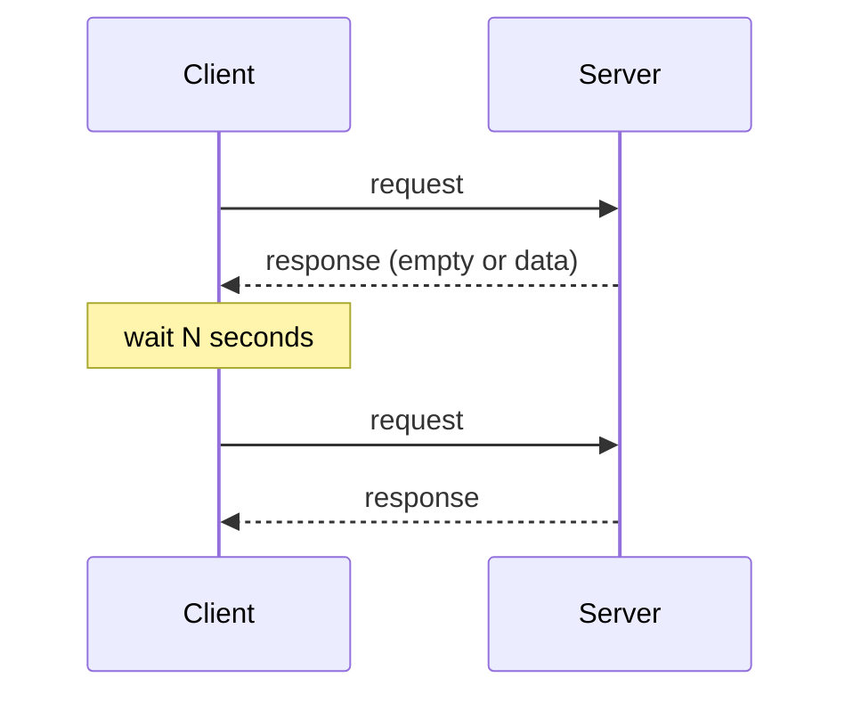
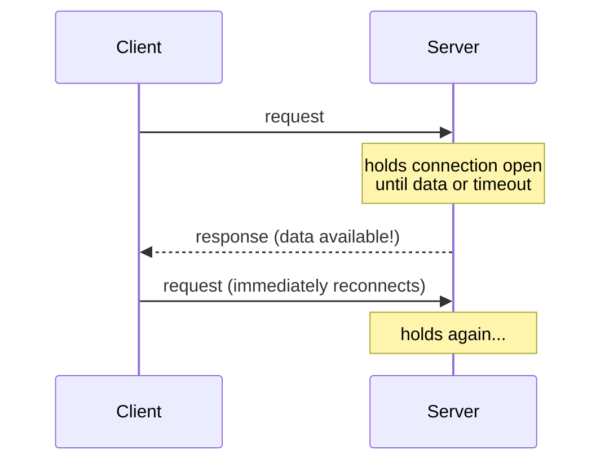
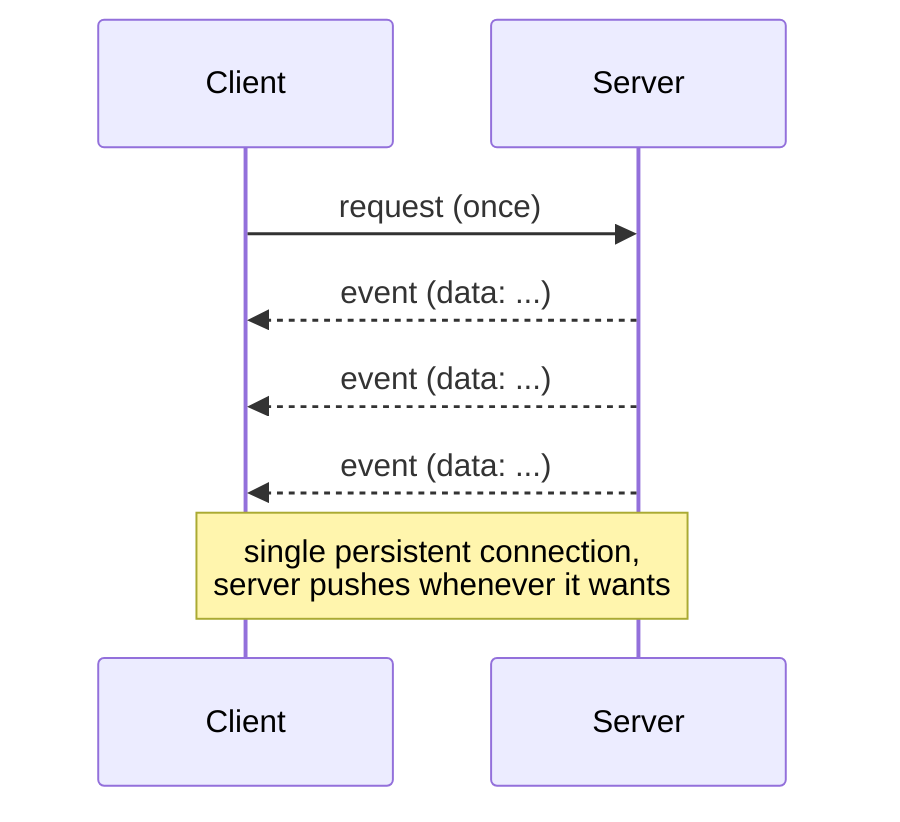
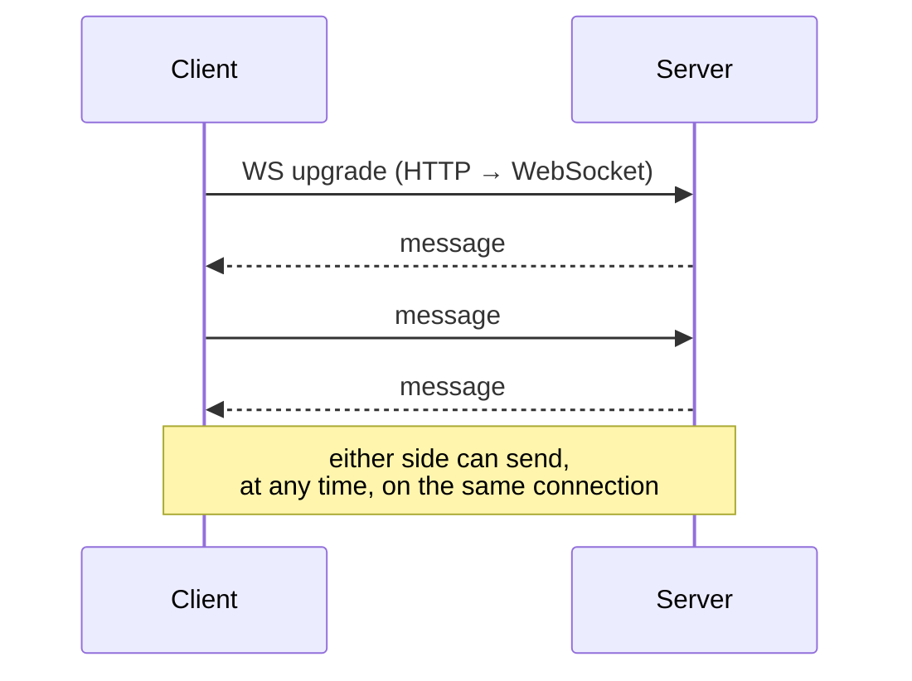
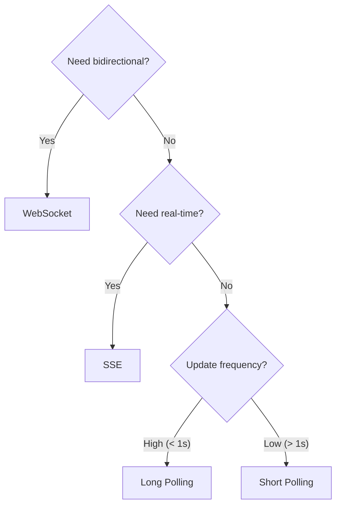

# Polling vs Push

Three common patterns for a client to receive data updates from a server.

---

## Short Polling

Client repeatedly sends requests at a fixed interval regardless of whether new data exists.

**How it works:** Client fires HTTP request every N seconds. Server responds immediately with current data or empty.

| Pros | Cons |
|------|------|
| Simple to implement | Wastes bandwidth when no new data |
| Works with any HTTP server | High server load from frequent requests |
| Easy to debug | Latency = up to N seconds |

**Use when:** Simple use cases, infrequent updates, or when server-side complexity must be minimal.

---

## Long Polling

Client sends a request; server holds it open until new data is available, then responds. Client immediately re-connects.

**How it works:** Server blocks the response until an event occurs or a timeout is hit. On timeout, returns empty and client reconnects.

| Pros | Cons |
|------|------|
| Near real-time delivery | Ties up server threads/connections |
| No wasted empty responses | Complex server-side implementation |
| Works through firewalls/proxies | Still HTTP overhead per message |

**Use when:** Near-real-time needed but WebSockets are unavailable; e.g. older chat systems, Comet.

---

## Push (Server-Sent Events / WebSocket)

Server proactively sends data to the client when events occur — no repeated client requests.

### Server-Sent Events (SSE)

One-way: server → client over a persistent HTTP connection.

### WebSocket

Full-duplex: client ↔ server over a single persistent TCP connection.

| Pros | Cons |
|------|------|
| True real-time, minimal latency | Requires persistent connection management |
| Efficient — no repeated HTTP overhead | Load balancers / proxies need WS support |
| Server controls when to push | More complex infrastructure (sticky sessions or pub/sub) |

**Use when:** Live feeds (market data, notifications, collaborative editing, gaming).

---

## Comparison

| | Short Polling | Long Polling | Push (SSE/WS) |
|---|---|---|---|
| **Latency** | Up to N seconds | Near real-time | Real-time |
| **Server load** | High (constant requests) | Medium | Low (event-driven) |
| **Client complexity** | Low | Low | Medium |
| **Server complexity** | Low | Medium | High |
| **Bidirectional** | No | No | SSE: No / WS: Yes |
| **Firewall friendly** | Yes | Yes | Usually (port 80/443) |

---

## Decision Guide

---

## Real-World Examples

| Pattern | Example |
|---------|---------|
| Short Polling | Legacy dashboard refreshing every 30s |
| Long Polling | Facebook Chat (early), JIRA issue updates |
| SSE | Twitter/X live feed, stock tickers |
| WebSocket | Trading platforms, collaborative docs (Google Docs), multiplayer games |
